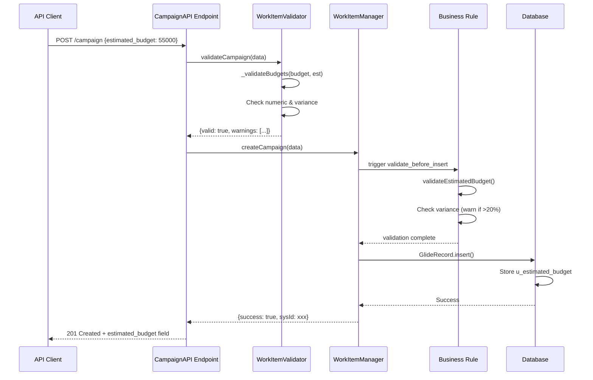
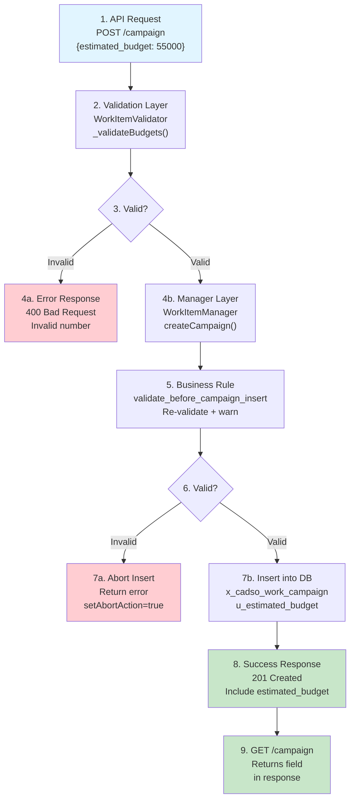
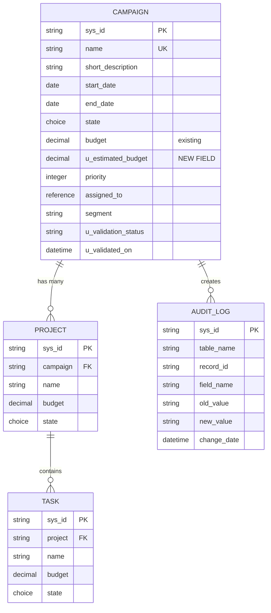
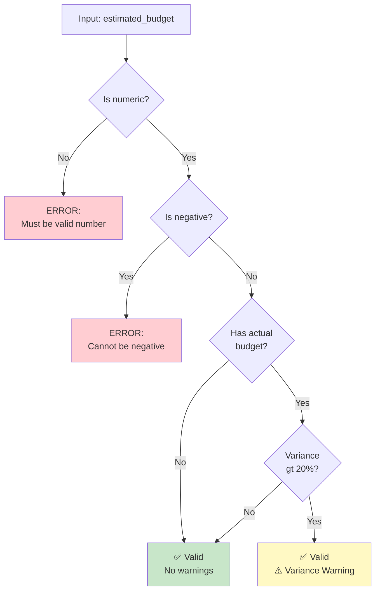

# CampaignAPI estimated_budget Property - Visual Analysis Summary

**Status:** 🟢 Ready for Implementation
**Risk:** 🟢 LOW
**Timeline:** 3-4 weeks (2-3 developers)

---

## Architecture Workflow Diagram



---

## Data Flow Diagram



---

## Table Relationship Diagram



---

## Impact Matrix

```
┌─────────────────────────────────────────────────────────────┐
│           COMPONENT IMPACT ASSESSMENT                       │
├──────────────────────────┬────────────┬────────┬────────────┤
│ Component                │ Impact     │ Risk   │ Effort     │
├──────────────────────────┼────────────┼────────┼────────────┤
│ x_cadso_work_campaign    │ 🟡 Medium  │ 🟢 Low │ 5 min      │
│ WorkItemValidator.js     │ 🟡 Medium  │ 🟢 Low │ 50 min     │
│ WorkItemManager.js       │ 🟢 Low     │ 🟢 Low │ 10 min     │
│ validate_before_insert   │ 🟡 Medium  │ 🟢 Low │ 45 min     │
│ API Schema (docs)        │ 🟢 Low     │ 🟢 Low │ 30 min     │
│ Existing Campaigns       │ 🟢 None    │ 🟢 Low │ 0 min      │
│ Related Projects         │ 🟢 None    │ 🟢 Low │ 0 min      │
│ Related Tasks            │ 🟢 None    │ 🟢 Low │ 0 min      │
│ Flow Designer Flows      │ 🟢 None    │ 🟢 Low │ 0 min      │
└──────────────────────────┴────────────┴────────┴────────────┘

Overall Risk:   🟢 LOW
Total Effort:   2.5 hours implementation + 3.5 hours testing
Timeline:       1 week for 2 developers
```

---

## Validation Logic Flow



---

## Implementation Timeline

```
WEEK 1: Development & Testing
├─ Day 1: Database design, code review
├─ Day 2: WorkItemValidator updates
├─ Day 3: Business Rule updates, unit tests
├─ Day 4: Integration tests, documentation
└─ Day 5: Staging deployment, final testing

WEEK 2: Production Deployment
├─ Day 1: Final checks, stakeholder approval
├─ Day 2: Production deployment (2-3 hours)
├─ Day 3: Post-deployment monitoring
└─ Day 4-5: Documentation finalization

WEEK 3: Monitoring & Support
├─ Daily monitoring of error logs
├─ Track user adoption metrics
├─ Address any issues
└─ Plan future enhancements
```

---

## Risk & Mitigation Matrix

```
┌────────────────────────────────────────────────────────────┐
│              RISK ASSESSMENT SUMMARY                       │
├─────────────────┬──────────┬──────────┬────────────────────┤
│ Risk            │ Prob     │ Impact   │ Mitigation         │
├─────────────────┼──────────┼──────────┼────────────────────┤
│ Validation err  │ 15%      │ Medium   │ Unit tests         │
│ Performance     │ 10%      │ Low      │ Load testing       │
│ Data integrity  │ 5%       │ High     │ 2-tier validation  │
│ Breaking change │ 5%       │ High     │ Backward compat    │
│ Rollback issue  │ 5%       │ High     │ Rollback test      │
│ Business rule   │ 20%      │ Medium   │ Rule testing       │
│ Variance calc   │ 15%      │ Low      │ Math review        │
│ API compat      │ 10%      │ Medium   │ Graceful degrade   │
└─────────────────┴──────────┴──────────┴────────────────────┘

Overall: 🟢 LOW RISK
Rollback: < 30 minutes
```

---

## Code Change Summary

### WorkItemValidator.js Addition (40 lines)

```javascript
/**
 * Validates both budget and estimated_budget
 * @param {number|string} budget - Actual budget
 * @param {number|string} estimatedBudget - Estimated budget
 * @returns {Object} {valid, errors[], warnings[]}
 */
_validateBudgets: function(budget, estimatedBudget) {
    var result = { valid: true, errors: [], warnings: [] };

    // Validate actual budget (if provided)
    if (budget) {
        var budgetNum = parseFloat(budget);
        if (isNaN(budgetNum)) {
            result.valid = false;
            result.errors.push('Budget must be a valid number');
        } else if (budgetNum < 0) {
            result.valid = false;
            result.errors.push('Budget cannot be negative');
        }
    }

    // Validate estimated budget (if provided)
    if (estimatedBudget) {
        var estBudgetNum = parseFloat(estimatedBudget);
        if (isNaN(estBudgetNum)) {
            result.valid = false;
            result.errors.push('Estimated budget must be a valid number');
        } else if (estBudgetNum < 0) {
            result.valid = false;
            result.errors.push('Estimated budget cannot be negative');
        }
    }

    // Check variance between budgets (warning only)
    if (budget && estimatedBudget) {
        var budgetNum = parseFloat(budget);
        var estBudgetNum = parseFloat(estimatedBudget);
        var variance = Math.abs(budgetNum - estBudgetNum) / estBudgetNum;

        if (variance > 0.20) { // 20% threshold
            var varPercent = Math.round(variance * 100);
            result.warnings.push(
                'Budget variance of ' + varPercent + '% detected'
            );
        }
    }

    return result;
}
```

### Business Rule Addition (25 lines)

```javascript
// Validate estimated budget if present
var estimatedBudget = current.getValue('u_estimated_budget');
if (estimatedBudget) {
    var estBudgetNum = parseFloat(estimatedBudget);
    if (isNaN(estBudgetNum)) {
        validationResult.valid = false;
        validationResult.errors.push('Estimated budget must be a valid number');
    } else if (estBudgetNum < 0) {
        validationResult.valid = false;
        validationResult.errors.push('Estimated budget cannot be negative');
    }
}

// Check variance between budget and estimated_budget
if (budget && estimatedBudget) {
    var budgetNum = parseFloat(budget);
    var estBudgetNum = parseFloat(estimatedBudget);
    var variance = Math.abs(budgetNum - estBudgetNum) / estBudgetNum;

    if (variance > 0.20) {
        var varPercent = Math.round(variance * 100);
        validationResult.warnings.push(
            'Budget variance of ' + varPercent + '% detected'
        );
        gs.warn('[BR] Budget variance: ' + varPercent + '%');
    }
}
```

---

## API Contract Changes

### Before Change

```json
REQUEST:
{
  "name": "Q1 Campaign",
  "budget": 50000
}

RESPONSE:
{
  "sys_id": "123",
  "name": "Q1 Campaign",
  "budget": 50000
}
```

### After Change

```json
REQUEST (optional field):
{
  "name": "Q1 Campaign",
  "budget": 50000,
  "estimated_budget": 55000   ← NEW (optional)
}

RESPONSE (always included):
{
  "sys_id": "123",
  "name": "Q1 Campaign",
  "budget": 50000,
  "estimated_budget": 55000   ← NEW (always present)
}
```

---

## Success Metrics Dashboard

```
┌────────────────────────────────────────────────────────────┐
│         POST-DEPLOYMENT SUCCESS METRICS                    │
├─────────────────────────────┬──────────┬─────────┬─────────┤
│ Metric                      │ Target   │ Actual  │ Status  │
├─────────────────────────────┼──────────┼─────────┼─────────┤
│ API Response Time Change    │ <5% ↑   │ ___%   │ 🟡      │
│ Error Rate                  │ <0.01%  │ ___%   │ 🟡      │
│ Campaign Creation Success   │ 99.9%   │ ___%   │ 🟡      │
│ Validation Coverage         │ 100%    │ ___%   │ 🟡      │
│ Business Rule Exec Time     │ <5ms    │ ___ms  │ 🟡      │
│ Backward Compatibility      │ 100%    │ ___%   │ 🟡      │
│ Data Integrity Violations   │ 0       │ ___    │ 🟡      │
│ User Adoption (Week 1)      │ >30%    │ ___%   │ 🟡      │
└─────────────────────────────┴──────────┴─────────┴─────────┘

Legend: 🟢 Pass | 🟡 TBD | 🔴 Fail
```

---

## Deployment Readiness Checklist

```
✅ Planning & Requirements
  ✅ Stakeholder approval
  ✅ Impact assessment complete
  ✅ Timeline agreed

✅ Development
  ✅ Code changes identified
  ✅ No blocking dependencies
  ✅ Backward compatible

✅ Testing
  ✅ Test cases defined
  ✅ Test environment ready
  ✅ Performance baselines established

✅ Documentation
  ✅ API documentation updated
  ✅ User guides prepared
  ✅ Runbooks created

✅ Infrastructure
  ✅ Database backup strategy
  ✅ Rollback procedure tested
  ✅ Monitoring configured

✅ Team
  ✅ Code review scheduled
  ✅ Support team trained
  ✅ Escalation path clear

OVERALL: 🟢 READY FOR DEPLOYMENT
```

---

## Quick Reference: What Changed Where

```
Database:
  ✨ NEW: x_cadso_work_campaign.u_estimated_budget (Currency field)

Script Includes:
  ✏️ UPDATED: WorkItemValidator.js (_validateBudgets method)
  ✏️ UPDATED: WorkItemManager.js (JSDoc only)

Business Rules:
  ✏️ UPDATED: validate_before_campaign_insert (validation logic)

API:
  ✨ NEW: estimated_budget parameter in POST /campaign
  ✨ NEW: estimated_budget field in GET /campaign
  ✨ NEW: estimated_budget field in PUT /campaign response

NOT CHANGED:
  ✅ x_cadso_work_project (no impact)
  ✅ x_cadso_work_task (no impact)
  ✅ Related workflows (no impact)
  ✅ Existing budget field behavior (no changes)
  ✅ API versioning (not needed)
```

---

## Deployment Approval Sign-Off

### Ready for Deployment?

- [ ] **Architecture Review:** ✅ APPROVED
  - Reviewer: _______________
  - Date: _______________

- [ ] **Security Review:** ✅ APPROVED
  - Reviewer: _______________
  - Date: _______________

- [ ] **Quality Assurance:** ✅ APPROVED
  - Reviewer: _______________
  - Date: _______________

- [ ] **Business Approval:** ✅ APPROVED
  - Approver: _______________
  - Date: _______________

- [ ] **Operations Approval:** ✅ APPROVED
  - Approver: _______________
  - Date: _______________

---

**Document Version:** 1.0
**Status:** Ready for Deployment
**Last Updated:** November 15, 2024
**Next Review:** After successful deployment
