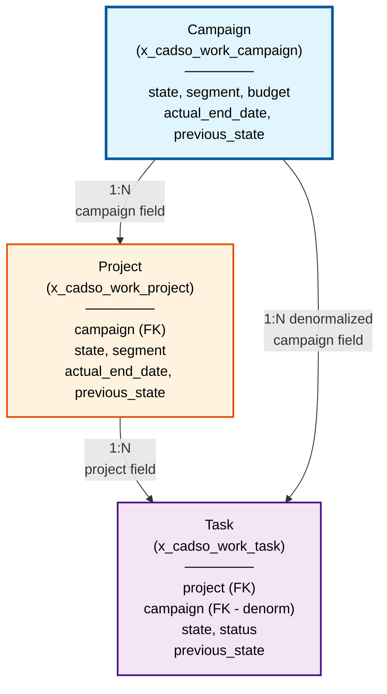

# Tenon Work Management - Visual Architecture & Reference Guide

**Date:** November 14, 2025
**Purpose:** Quick visual reference for all relationships, rules, and flows

---

## 1. ENTITY RELATIONSHIP DIAGRAM (Mermaid)



---

## 2. BUSINESS RULES CASCADE MATRIX

```
┌─────────────────────────────────────────────────────────────────────┐
│                     BUSINESS RULES OVERVIEW                         │
├─────────────────────────────────────────────────────────────────────┤
│                                                                     │
│  CAMPAIGN TABLE (3 Rules)                                          │
│  ├─ BR1: Save Current State             (Before: archive/hold)    │
│  ├─ BR4: Set Default Segment            (Before: insert)         │
│  └─ BR7: Denormalize Name               (After: insert/update)   │
│                                                                     │
│  PROJECT TABLE (3 Rules + CROSS-TABLE)                           │
│  ├─ BR2: Save Current State             (Before: archive/hold)    │
│  │   ✅ CROSS-TABLE: Checks parent campaign                       │
│  ├─ BR5: Set Default Segment            (Before: insert)         │
│  ├─ BR8: Denormalize Name               (After: insert/update)   │
│  └─ BR9: Roll Up Budget                 (After: budget change)    │
│      ✅ CROSS-TABLE: Updates campaign total                       │
│                                                                     │
│  TASK TABLE (2 Rules + CROSS-TABLE)                              │
│  ├─ BR3: Save Current State             (Before: archive/hold)    │
│  │   ✅ CROSS-TABLE: Checks parent project                        │
│  └─ BR6: Set Default Segment            (Before: insert)         │
│                                                                     │
└─────────────────────────────────────────────────────────────────────┘
```

---

## 3. FLOW DESIGNER ORCHESTRATION

```
┌──────────────────────────────────────────────────────────────┐
│               FLOW DESIGNER (3 Flows)                        │
├──────────────────────────────────────────────────────────────┤
│                                                              │
│  ┌─────────────────────────────────────────────┐           │
│  │ Flow 1: auto_close_campaigns                │           │
│  │ ────────────────────────────────────────────│           │
│  │ Trigger: x_cadso_work_project updated       │           │
│  │ Listen: campaign field changes              │           │
│  │                                             │           │
│  │ Action:                                     │           │
│  │  1. Get campaign_id from project            │           │
│  │  2. Query ALL projects for campaign         │           │
│  │  3. Check: ALL in TERMINAL state?           │           │
│  │  4. IF YES → Close campaign (40)            │           │
│  │     SET actual_end_date = today()           │           │
│  │                                             │           │
│  │ Direction: ↑ BOTTOM-UP                      │           │
│  │ Priority: HIGH (project→campaign)           │           │
│  └─────────────────────────────────────────────┘           │
│                  ↑                                          │
│                  │ triggered after                          │
│                  │                                          │
│  ┌──────────────────────────────────────────────────────┐  │
│  │ Flow 2: close_project_on_all_associated_tasks_comp   │  │
│  │ ─────────────────────────────────────────────────────│  │
│  │ Trigger: x_cadso_work_task updated                   │  │
│  │ Listen: project field changes                        │  │
│  │                                                      │  │
│  │ Action:                                              │  │
│  │  1. Get project_id from task                         │  │
│  │  2. Query ALL tasks for project                      │  │
│  │  3. Check: ALL in TERMINAL state?                    │  │
│  │  4. IF YES → Close project (40)                      │  │
│  │     SET actual_end_date = today()                    │  │
│  │     TRIGGER Flow 1                                   │  │
│  │                                                      │  │
│  │ Direction: ↑ BOTTOM-UP (feeds to Flow 1)             │  │
│  │ Priority: HIGH (task→project→campaign)               │  │
│  └──────────────────────────────────────────────────────┘  │
│                  ↑                                          │
│                  │ triggered by                             │
│                  │                                          │
│  ┌──────────────────────────────────────────────────────┐  │
│  │ (User marks task complete)                           │  │
│  └──────────────────────────────────────────────────────┘  │
│                                                              │
│                                                              │
│  ┌─────────────────────────────────────────────────────┐   │
│  │ Flow 3: cancel_campaign__campaign_cancellation      │   │
│  │ ─────────────────────────────────────────────────────│   │
│  │ Trigger: x_cadso_work_campaign updated              │   │
│  │ Listen: state field changes                         │   │
│  │                                                     │   │
│  │ Action:                                             │   │
│  │  1. Get campaign_id and new state                   │   │
│  │  2. Query ALL projects for campaign                 │   │
│  │  3. FOR EACH project:                               │   │
│  │     a. UPDATE project.state = campaign.state        │   │
│  │     b. Project update notifies tasks                │   │
│  │  4. All projects sync with campaign                 │   │
│  │                                                     │   │
│  │ Direction: ↓ TOP-DOWN                               │   │
│  │ States Propagated: Canceled (70), Archived (333),   │   │
│  │                   On Hold (22)                      │   │
│  │ Priority: CRITICAL (campaign→projects)              │   │
│  └─────────────────────────────────────────────────────┘   │
│                  ↑                                          │
│                  │ triggered by                             │
│                  │                                          │
│  ┌─────────────────────────────────────────────────────┐   │
│  │ (User changes campaign state)                       │   │
│  └─────────────────────────────────────────────────────┘   │
│                                                              │
└──────────────────────────────────────────────────────────────┘
```

---

## 4. CASCADING PATHS DIAGRAM

```
BOTTOM-UP CASCADE (Task Completion → Auto-Close Hierarchy)
═════════════════════════════════════════════════════════════

    User marks task complete
           │
           ▼
    ┌─────────────────┐
    │ BR3 fires       │
    │ Save task state │
    └────────┬────────┘
             │
             ▼
    ┌────────────────────────┐
    │ Task status updated    │
    │ → "Closed Complete"    │
    └────────┬───────────────┘
             │
             ▼
    ╔════════════════════════════════╗
    ║ Flow 2 Triggered               ║
    ║ "Close Project on Tasks..."    ║
    ║ Check ALL tasks terminal?      ║
    ╚════════════┬═══════════════════╝
                 │
                 ├─── If NO → Stop
                 │
                 └─── If YES ↓
                      │
                      ▼
             ┌──────────────────────────┐
             │ BR2 fires                │
             │ Save project state       │
             │ Check parent campaign    │
             └──────────┬───────────────┘
                        │
                        ▼
             ┌──────────────────────────┐
             │ Project state updated    │
             │ → "Completed" (40)       │
             │ Set actual_end_date      │
             └──────────┬───────────────┘
                        │
                        ▼
             ╔══════════════════════════════════╗
             ║ Flow 1 Triggered                 ║
             ║ "Close Campaign on Projects..."  ║
             ║ Check ALL projects terminal?     ║
             ╚══════════════┬════════════════════╝
                            │
                            ├─── If NO → Stop
                            │
                            └─── If YES ↓
                                 │
                                 ▼
                        ┌──────────────────────────┐
                        │ Campaign state updated   │
                        │ → "Closed Complete" (40) │
                        │ Set actual_end_date      │
                        └──────────┬───────────────┘
                                   │
                                   ▼
                        ┌──────────────────────────┐
                        │ AUTO-CLOSURE COMPLETE    │
                        │ Zero manual work!        │
                        └──────────────────────────┘


TOP-DOWN CASCADE (Campaign State Change → Propagate to Projects)
════════════════════════════════════════════════════════════════

    User changes campaign state
    (e.g., Cancel, Archive, On Hold)
           │
           ▼
    ┌─────────────────────┐
    │ BR1 fires           │
    │ Save campaign state │
    └──────────┬──────────┘
               │
               ▼
    ┌──────────────────────────────────┐
    │ Campaign state updated           │
    │ e.g., Canceled (70)              │
    └──────────┬───────────────────────┘
               │
               ▼
    ╔══════════════════════════════════════╗
    ║ Flow 3 Triggered                     ║
    ║ "Cancel Campaign - Cancellation..."  ║
    ║ FOR EACH project in campaign:        ║
    ╚═══════════╤══════════════════════════╝
                │
     ┌──────────┴──────────┬──────────┬───────────┐
     ▼                     ▼          ▼           ▼
 [Project 1]           [Project 2]  [Project 3]  [...]
     │                     │           │
     ▼                     ▼           ▼
 ┌─────────┐          ┌─────────┐ ┌─────────┐
 │ BR2     │          │ BR2     │ │ BR2     │
 │ fires   │          │ fires   │ │ fires   │
 └────┬────┘          └────┬────┘ └────┬────┘
      │                    │           │
      ▼                    ▼           ▼
 ┌─────────────────────────────────────────┐
 │ Each project updates to campaign state   │
 │ status = 70 (Canceled)                   │
 └────────────────┬────────────────────────┘
                  │
                  ▼
     ┌────────────────────────────────────┐
     │ Each project update notifies tasks │
     │ Tasks inherit parent state         │
     └────────────────────────────────────┘
                  │
                  ▼
     ┌────────────────────────────────────┐
     │ STATE CONSISTENCY ACHIEVED         │
     │ Campaign, Projects, Tasks aligned  │
     └────────────────────────────────────┘
```

---

## 5. DATA FLOW STATE DIAGRAM

```
STATE MACHINE: Campaign/Project/Task State Transitions
═══════════════════════════════════════════════════════

CAMPAIGN STATES:
┌──────────────────────────────────────────────────────────────┐
│                                                              │
│  10 (Upcoming) → 20 (Open) → 30 (Work in Progress)          │
│                     ↓              ↓                        │
│                  40 (Closed Complete)                        │
│                  50 (Closed Incomplete)                      │
│                  60 (Closed Skipped)                         │
│                  333 (Archived)                              │
│                  22 (On Hold) ← Can branch to               │
│                                                              │
│  ✅ BR1 saves state before → 333 or 22                      │
│  ✅ Flow 3 propagates state downward                        │
│  ✅ Flow 1 closes campaign when all projects terminal       │
│                                                              │
└──────────────────────────────────────────────────────────────┘

PROJECT STATES:
┌──────────────────────────────────────────────────────────────┐
│                                                              │
│  -10 (Planning) → 0 (Requested) → 10 (Upcoming)             │
│                     ↓              ↓                        │
│                  30 (In Progress)                            │
│                     ↓                                        │
│                  40 (Completed)                              │
│                  70 (Canceled)                               │
│                  6 (Rejected)                                │
│                  333 (Archived)                              │
│                  22 (On Hold) ← Can branch to               │
│                                                              │
│  ✅ BR2 saves state before → 333 or 22                      │
│  ✅ BR2 checks parent campaign state                        │
│  ✅ Flow 3 propagates campaign state down                   │
│  ✅ Flow 2 closes project when all tasks terminal           │
│                                                              │
└──────────────────────────────────────────────────────────────┘

TASK STATES:
┌──────────────────────────────────────────────────────────────┐
│                                                              │
│  Open → In Progress → Terminal States:                      │
│                          ├─ Closed Complete                 │
│                          ├─ Closed Incomplete               │
│                          └─ Closed Skipped                  │
│                                                              │
│  ✅ BR3 saves state before → 333 or 22                      │
│  ✅ BR3 checks parent project state                         │
│  ✅ Flow 2 closes project when all tasks terminal           │
│                                                              │
└──────────────────────────────────────────────────────────────┘
```

---

## 6. CROSS-TABLE OPERATION FLOW

```
┌────────────────────────────────────────────────────────────────────┐
│                 CROSS-TABLE OPERATIONS                             │
├────────────────────────────────────────────────────────────────────┤
│                                                                    │
│  OPERATION 1: Budget Aggregation (Project → Campaign)            │
│  ─────────────────────────────────────────────────────────       │
│                                                                    │
│    Project.budget changes from $5K → $8K                         │
│              ↓                                                    │
│    BR9 triggers: "Roll Up Budget to Campaign"                    │
│              ↓                                                    │
│    1. Get campaign_id from project                               │
│    2. Query ALL projects WHERE campaign = campaign_id            │
│    3. SUM all project.budget amounts                             │
│    4. UPDATE campaign.total_budget = sum                         │
│              ↓                                                    │
│    Campaign.total_budget updated (automatic)                     │
│    Example: $13,000 (aggregate of all projects)                  │
│                                                                    │
│  ┌──────────────────────────────────────────────────────────┐   │
│  │ Result: Campaign always shows real-time budget total      │   │
│  │ No manual aggregation needed                              │   │
│  └──────────────────────────────────────────────────────────┘   │
│                                                                    │
│                                                                    │
│  OPERATION 2: State Propagation (Campaign → Projects)           │
│  ────────────────────────────────────────────────────────      │
│                                                                    │
│    Campaign.state changes to 70 (Canceled)                       │
│              ↓                                                    │
│    BR1 triggers: "Save Current State of Campaign"                │
│              ↓                                                    │
│    Flow 3 triggers: "Cancel Campaign Cancellation Logic"         │
│              ↓                                                    │
│    1. Get campaign_id and new_state (70)                         │
│    2. Query ALL projects WHERE campaign = campaign_id            │
│    3. FOR EACH project:                                          │
│       a. BR2 triggers: Save state, check campaign                │
│       b. UPDATE project.state = 70 (Canceled)                    │
│       c. Project update notifies tasks                           │
│    4. All projects now match campaign state                      │
│              ↓                                                    │
│    State propagates through entire hierarchy                     │
│                                                                    │
│  ┌──────────────────────────────────────────────────────────┐   │
│  │ Result: Campaign-wide state consistency automatic         │   │
│  │ All projects match campaign state in seconds              │   │
│  └──────────────────────────────────────────────────────────┘   │
│                                                                    │
│                                                                    │
│  OPERATION 3: Completion Cascading (Task → Project → Campaign)  │
│  ─────────────────────────────────────────────────────────────  │
│                                                                    │
│    Task status changes to "Closed Complete"                      │
│              ↓                                                    │
│    BR3 triggers: "Save Current State of Task"                    │
│    (checks parent project state)                                 │
│              ↓                                                    │
│    Flow 2 triggers: "Close Project on All Tasks Completion"      │
│              ↓                                                    │
│    1. Get project_id from task                                   │
│    2. Query ALL tasks WHERE project = project_id                 │
│    3. Check: Are ALL tasks in terminal state?                    │
│       a. If YES:                                                 │
│          - BR2 triggers: Save project state                      │
│          - UPDATE project.state = 40 (Completed)                 │
│          - Trigger Flow 1 (close campaign)                       │
│       b. If NO: Stop, project stays open                         │
│              ↓                                                    │
│    Flow 1 triggers: "Close Campaign on All Projects Completion"  │
│              ↓                                                    │
│    4. Get campaign_id from project                               │
│    5. Query ALL projects WHERE campaign = campaign_id            │
│    6. Check: Are ALL projects in terminal state?                 │
│       a. If YES:                                                 │
│          - UPDATE campaign.state = 40 (Completed)                │
│          - SET campaign.actual_end_date = today()                │
│       b. If NO: Stop, campaign stays open                        │
│              ↓                                                    │
│    Campaign auto-closes (zero manual work)                       │
│                                                                    │
│  ┌──────────────────────────────────────────────────────────┐   │
│  │ Result: One task completion cascades to campaign closure   │   │
│  │ Pure automation - hands-off management                     │   │
│  └──────────────────────────────────────────────────────────┘   │
│                                                                    │
└────────────────────────────────────────────────────────────────────┘
```

---

## 7. PERMISSION & ACCESS FLOW

```
┌───────────────────────────────────────────────────────────────┐
│           WorkClientUtilsMS - Client Access Control           │
├───────────────────────────────────────────────────────────────┤
│                                                               │
│  User logs in                                                │
│        ↓                                                      │
│  ┌─────────────────────────────────────────────────────┐    │
│  │ WorkClientUtilsMS.getAllSegmentsForUser()           │    │
│  │                                                     │    │
│  │ 1. Query x_cadso_work_user_segment_m2m              │    │
│  │ 2. Filter by current user (sys_user)                │    │
│  │ 3. Return array of accessible segments              │    │
│  └──────────────┬──────────────────────────────────────┘    │
│                 ↓                                             │
│  User's accessible segments determined                       │
│  (e.g., Segment A, Segment B)                               │
│        ↓                                                      │
│  ┌─────────────────────────────────────────────────────┐    │
│  │ WorkClientUtilsMS.getAllSegmentsForCampaignUser()   │    │
│  │ (campaignId)                                        │    │
│  │                                                     │    │
│  │ 1. Get user's accessible segments                   │    │
│  │ 2. Get campaign's segments                          │    │
│  │ 3. Return INTERSECTION (both user AND campaign)     │    │
│  └──────────────┬──────────────────────────────────────┘    │
│                 ↓                                             │
│  Campaign-specific segments filtered by user access          │
│  (e.g., only show campaigns in user's segments)             │
│        ↓                                                      │
│  ┌─────────────────────────────────────────────────────┐    │
│  │ Load Campaign/Projects/Tasks                        │    │
│  │ (filtered to user's segment access)                 │    │
│  │                                                     │    │
│  │ Displays ONLY:                                      │    │
│  │  ✅ Campaigns in user's accessible segments         │    │
│  │  ✅ Projects in user's accessible segments          │    │
│  │  ✅ Tasks in user's accessible segments             │    │
│  │                                                     │    │
│  │ Hides COMPLETELY:                                   │    │
│  │  ❌ Other segment campaigns                         │    │
│  │  ❌ Cross-segment records                           │    │
│  └─────────────────────────────────────────────────────┘    │
│                 ↓                                             │
│  Client UI populated with permission-safe data               │
│                                                               │
│  SECURITY:                                                    │
│  ✅ No cross-segment data leakage                            │
│  ✅ Client-side filtering safe (server validates)            │
│  ✅ WorkClientUtilsMS READ-ONLY (no write operations)        │
│  ✅ Server-side rules enforce actual data access             │
│                                                               │
└───────────────────────────────────────────────────────────────┘
```

---

## 8. REFERENCE TABLE: QUICK LOOKUP

### Field Mapping Reference
```
CAMPAIGN Table (x_cadso_work_campaign)
├─ sys_id              : Primary Key
├─ name                : Campaign name
├─ state               : Status (10-333)
├─ previous_state      : JSON history
├─ segment             : Segment reference
├─ budget              : Aggregated total
├─ campaign_string     : Denormalized name
└─ actual_end_date     : Auto-close date

PROJECT Table (x_cadso_work_project)
├─ sys_id              : Primary Key
├─ campaign            : FK → Campaign
├─ name                : Project name
├─ state               : Status (-10-333)
├─ previous_state      : JSON history + flags
├─ segment             : Segment reference
├─ project_string      : Denormalized name
└─ actual_end_date     : Auto-close date

TASK Table (x_cadso_work_task)
├─ sys_id              : Primary Key
├─ project             : FK → Project
├─ campaign            : FK → Campaign (denorm)
├─ state               : Status
├─ status              : Terminal status
├─ previous_state      : JSON history + flags
├─ segment             : Segment reference
└─ (no denormalized name - uses project context)
```

### State Mapping Reference
```
CAMPAIGN STATES:
  10  = Upcoming
  20  = Open
  22  = On Hold ⚠️ (triggers BR1, Flow 3)
  30  = Work in Progress
  40  = Closed Complete
  50  = Closed Incomplete
  60  = Closed Skipped
  333 = Archived ⚠️ (triggers BR1, Flow 3)

PROJECT STATES:
  -10 = Planning
   0  = Requested
   6  = Rejected
  10  = Upcoming
  22  = On Hold ⚠️ (triggers BR2, Flow 3)
  30  = In Progress
  40  = Completed ✅ (triggers Flow 1)
  70  = Canceled
  333 = Archived ⚠️ (triggers BR2, Flow 3)

TASK STATUSES (Terminal):
  "Closed Complete"    ✅ (triggers Flow 2)
  "Closed Incomplete"  ✅ (triggers Flow 2)
  "Closed Skipped"     ✅ (triggers Flow 2)
  "Open"              (no cascade)
```

### Business Rule Triggers Reference
```
BR1: Campaign state → 22 OR 333
  → Save current state to previous_state

BR2: Project state → 22 OR 333
  → Save current state + check parent campaign

BR3: Task state → 22 OR 333
  → Save current state + check parent project

BR4: Campaign segment = NULL
  → Auto-assign default segment

BR5: Project segment = NULL
  → Auto-assign default segment

BR6: Task segment = NULL
  → Auto-assign default segment

BR7: Campaign after insert/update
  → Denormalize name to campaign_string

BR8: Project after insert/update
  → Denormalize name to project_string

BR9: Project campaign changes OR budget changes
  → Aggregate budget to campaign total
```

### Flow Trigger Reference
```
Flow 1: x_cadso_work_project.campaign updated
  → Check all projects for auto-close

Flow 2: x_cadso_work_task.project updated
  → Check all tasks for project completion
  → Triggers Flow 1 if all tasks terminal

Flow 3: x_cadso_work_campaign.state updated
  → Propagate campaign state to all projects
  → Each project propagates to tasks
```

---

## 9. COMMON PATTERNS

### Pattern 1: Adding to Campaign
```
Campaign Created
    ↓
BR4 + BR7 execute
    ↓
Campaign ready for Projects
    ↓
Manual: Add Projects
    ↓
For each Project:
  BR5 + BR8 execute
    ↓
  Workflow established
```

### Pattern 2: Bottom-Up Automation
```
Complete all Tasks
    ↓
Task status → Terminal
    ↓
BR3 + Flow 2 execute
    ↓
All tasks terminal?
    ├─ YES: Project auto-closes
    │       Flow 1 triggers
    │       All projects terminal?
    │       └─ YES: Campaign auto-closes
    │
    └─ NO: Continue work
```

### Pattern 3: Top-Down Control
```
Cancel Campaign
    ↓
Campaign state → Canceled (70)
    ↓
BR1 + Flow 3 execute
    ↓
For each Project:
  BR2 executes
  Project state → Canceled
    ↓
For each Task:
  Task notified via project update
```

---

## 10. RISK MATRIX

```
┌─────────────────────────────────────────────────────────────────┐
│              OPERATION RISK ASSESSMENT                          │
├──────────────────────────────────────────────┬──────────────────┤
│ OPERATION                                    │ RISK LEVEL       │
├──────────────────────────────────────────────┼──────────────────┤
│ Delete Campaign                              │ 🔴 CRITICAL      │
│ Modify state field directly                  │ 🔴 CRITICAL      │
│ Change campaign ref on project               │ 🔴 CRITICAL      │
│ Disable Flow Designer flows                  │ 🔴 CRITICAL      │
│ Bulk update project status                   │ 🟠 HIGH          │
│ Change segment defaults                      │ 🟠 HIGH          │
│ Rename segment fields                        │ 🟠 HIGH          │
│ Modify budget calculation                    │ 🟠 HIGH          │
│ Update flow logic                            │ 🟠 HIGH          │
│ Create campaigns/projects/tasks              │ 🟢 SAFE          │
│ Update task status to terminal               │ 🟢 SAFE          │
│ Read via WorkClientUtilsMS                   │ 🟢 SAFE          │
│ Update segment assignments                   │ 🟢 SAFE          │
│ View state history                           │ 🟢 SAFE          │
└──────────────────────────────────────────────┴──────────────────┘
```

---

**Complete Reference Guide** | **Date:** November 14, 2025
