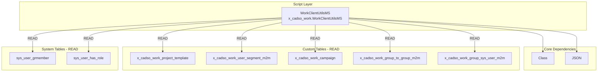

# WorkClientUtilsMS Script Include - Backend Analysis

**Document Version:** 1.2
**Analysis Date:** 2026-01-13
**Component Type:** Script Include
**API Name:** x_cadso_work.WorkClientUtilsMS
**Confidence Level:** HIGH

---

## 1. Executive Summary

The **WorkClientUtilsMS** Script Include is a server-side utility class within the Work Management application (`x_cadso_work`) that provides helper functions for client-facing operations. The script accesses **7 tables** (5 custom application tables and 2 system tables) with **READ-only operations**, making it a low-risk component from a data integrity perspective. It depends on core ServiceNow classes (`Class` and `JSON`) and currently has no API consumers detected in the backward dependency analysis.

**Key Findings:**
- All database operations are READ-only (no CREATE, UPDATE, DELETE)
- Accesses sensitive system tables (`sys_user_has_role`, `sys_user_grmember`) for user/role validation
- No detected backward dependencies (APIs, other scripts calling this)
- Risk Level: LOW-MEDIUM (READ-only operations with 7 table dependencies)

---

## 2. Existing System Analysis

### 2.1 Script CRUD Operations Query

**Tool Used:** `npm run query -- script-crud`
**Parameters:** `WorkClientUtilsMS`
**Confidence Level:** HIGH (complete CRUD mapping available)

```bash
$ cd tools/sn-tools/ServiceNow-Tools && npm run query -- script-crud WorkClientUtilsMS
{
  "success": true,
  "query_type": "script-crud",
  "target": "WorkClientUtilsMS",
  "data": {
    "script": "WorkClientUtilsMS",
    "api_name": "x_cadso_work.WorkClientUtilsMS",
    "tables": [
      "x_cadso_work_project_template",
      "x_cadso_work_user_segment_m2m",
      "x_cadso_work_campaign",
      "x_cadso_work_group_to_group_m2m",
      "x_cadso_work_group_sys_user_m2m",
      "sys_user_grmember",
      "sys_user_has_role"
    ],
    "crud_operations": {
      "x_cadso_work_project_template": { "create": false, "read": true, "update": false, "delete": false },
      "x_cadso_work_user_segment_m2m": { "create": false, "read": true, "update": false, "delete": false },
      "x_cadso_work_campaign": { "create": false, "read": true, "update": false, "delete": false },
      "x_cadso_work_group_to_group_m2m": { "create": false, "read": true, "update": false, "delete": false },
      "x_cadso_work_group_sys_user_m2m": { "create": false, "read": true, "update": false, "delete": false },
      "sys_user_grmember": { "create": false, "read": true, "update": false, "delete": false },
      "sys_user_has_role": { "create": false, "read": true, "update": false, "delete": false }
    },
    "dependencies": {
      "script_includes": ["Class", "JSON"],
      "apis": []
    }
  },
  "metadata": {
    "timestamp": "2026-01-13T22:50:27.323Z"
  }
}
```

**Key Findings from script-crud:**
- 7 tables accessed (5 custom, 2 platform)
- All operations are READ-only
- Dependencies on `Class` and `JSON` Script Includes
- No API dependencies detected

### 2.2 Full Lineage Trace

**Tool Used:** `npm run trace-lineage`
**Parameters:** `WorkClientUtilsMS script`
**Confidence Level:** HIGH (combined forward and backward analysis)

```bash
$ npm run trace-lineage -- WorkClientUtilsMS script
{
  "success": true,
  "entity_name": "WorkClientUtilsMS",
  "entity_type": "script",
  "trace_direction": "bidirectional",
  "data": {
    "forward": {
      "script_include": "WorkClientUtilsMS",
      "calls": [
        "Class",
        "JSON"
      ],
      "tables": [
        "x_cadso_work_project_template",
        "x_cadso_work_user_segment_m2m",
        "x_cadso_work_campaign",
        "x_cadso_work_group_to_group_m2m",
        "x_cadso_work_group_sys_user_m2m",
        "sys_user_grmember",
        "sys_user_has_role"
      ],
      "apis": []
    },
    "backward": {},
    "combined_lineage": {
      "forward_path": {
        "script_include": "WorkClientUtilsMS",
        "calls": [
          "Class",
          "JSON"
        ],
        "tables": [
          "x_cadso_work_project_template",
          "x_cadso_work_user_segment_m2m",
          "x_cadso_work_campaign",
          "x_cadso_work_group_to_group_m2m",
          "x_cadso_work_group_sys_user_m2m",
          "sys_user_grmember",
          "sys_user_has_role"
        ],
        "apis": []
      },
      "backward_dependencies": {},
      "diagram": "graph TB\n"
    }
  },
  "metadata": {
    "timestamp": "2026-01-13T22:50:31.795Z",
    "confidence": {
      "level": "HIGH",
      "reason": "Combined forward and backward analysis"
    }
  }
}
```

**Key Findings from trace-lineage:**
- Forward dependencies fully mapped (2 Script Includes, 7 tables)
- No backward dependencies detected (no scripts/APIs call this)
- Bidirectional trace completed successfully
- Empty backward dependencies suggest client-side (GlideAjax) or dynamic usage

### 2.3 Tables Accessed Summary

| # | Table Name | Type | Purpose |
|---|------------|------|---------|
| 1 | `x_cadso_work_project_template` | Custom | Project template definitions |
| 2 | `x_cadso_work_user_segment_m2m` | Custom (M2M) | User-to-segment relationships |
| 3 | `x_cadso_work_campaign` | Custom | Campaign records |
| 4 | `x_cadso_work_group_to_group_m2m` | Custom (M2M) | Group-to-group relationships |
| 5 | `x_cadso_work_group_sys_user_m2m` | Custom (M2M) | Group-to-user relationships |
| 6 | `sys_user_grmember` | System | User group membership (platform) |
| 7 | `sys_user_has_role` | System | User role assignments (platform) |

### 2.4 Script Include Dependencies

| Dependency | Type | Purpose |
|------------|------|---------|
| `Class` | Core ServiceNow | Object-oriented class creation |
| `JSON` | Core ServiceNow | JSON serialization/deserialization |

---

## 3. Complete Lineage/Dependencies

### 3.1 Mermaid Dependency Diagram



### 3.2 Text-Based Lineage

```
┌─────────────────────────────────────────────────────────────────────┐
│                      FORWARD DEPENDENCIES                           │
└─────────────────────────────────────────────────────────────────────┘

WorkClientUtilsMS (Script Include)
    │
    ├── Script Include Dependencies
    │   ├── Class (core)
    │   └── JSON (core)
    │
    └── Table Access (READ only)
        │
        ├── Custom Application Tables
        │   ├── x_cadso_work_project_template ───────────→ READ
        │   ├── x_cadso_work_user_segment_m2m ───────────→ READ
        │   ├── x_cadso_work_campaign ───────────────────→ READ
        │   ├── x_cadso_work_group_to_group_m2m ─────────→ READ
        │   └── x_cadso_work_group_sys_user_m2m ─────────→ READ
        │
        └── System Tables
            ├── sys_user_grmember ───────────────────────→ READ
            └── sys_user_has_role ───────────────────────→ READ

┌─────────────────────────────────────────────────────────────────────┐
│                      BACKWARD DEPENDENCIES                          │
└─────────────────────────────────────────────────────────────────────┘

No backward dependencies detected.
- No APIs consume this Script Include
- No other Script Includes call this script
- Possible usage: GlideAjax from client-side (not captured in static analysis)
```

### 3.3 Complete Dependency Chain

```
[No Detected Callers]
         │
         ↓
┌─────────────────────────────────────┐
│       WorkClientUtilsMS             │
│   x_cadso_work.WorkClientUtilsMS    │
│   (Script Include)                  │
└─────────────────────────────────────┘
         │
         ├──→ Class (extends)
         ├──→ JSON (uses)
         │
         ↓ (GlideRecord READ)
┌─────────────────────────────────────┐
│          7 TABLES                   │
├─────────────────────────────────────┤
│ Custom:                             │
│ • x_cadso_work_project_template     │
│ • x_cadso_work_user_segment_m2m     │
│ • x_cadso_work_campaign             │
│ • x_cadso_work_group_to_group_m2m   │
│ • x_cadso_work_group_sys_user_m2m   │
│                                     │
│ System:                             │
│ • sys_user_grmember                 │
│ • sys_user_has_role                 │
└─────────────────────────────────────┘
```

---

## 4. CRUD Operations

### 4.1 CRUD Operations Matrix

| Table | CREATE | READ | UPDATE | DELETE |
|-------|:------:|:----:|:------:|:------:|
| x_cadso_work_project_template | ✗ | ✓ | ✗ | ✗ |
| x_cadso_work_user_segment_m2m | ✗ | ✓ | ✗ | ✗ |
| x_cadso_work_campaign | ✗ | ✓ | ✗ | ✗ |
| x_cadso_work_group_to_group_m2m | ✗ | ✓ | ✗ | ✗ |
| x_cadso_work_group_sys_user_m2m | ✗ | ✓ | ✗ | ✗ |
| sys_user_grmember | ✗ | ✓ | ✗ | ✗ |
| sys_user_has_role | ✗ | ✓ | ✗ | ✗ |

**Legend:** ✓ = Operation performed | ✗ = Operation not performed

### 4.2 CRUD Analysis Summary

| Operation | Count | Tables |
|-----------|-------|--------|
| CREATE | 0 | None |
| READ | 7 | All tables |
| UPDATE | 0 | None |
| DELETE | 0 | None |

**Key Finding:** This Script Include is purely a **query/read utility**. It does not modify any data, which significantly reduces the risk of data corruption or unintended side effects.

---

## 5. Security Analysis

### 5.1 Access Control Requirements

| Table | Required ACL | Notes |
|-------|--------------|-------|
| x_cadso_work_project_template | read | Application-scoped ACL |
| x_cadso_work_user_segment_m2m | read | Application-scoped ACL |
| x_cadso_work_campaign | read | Application-scoped ACL |
| x_cadso_work_group_to_group_m2m | read | Application-scoped ACL |
| x_cadso_work_group_sys_user_m2m | read | Application-scoped ACL |
| sys_user_grmember | read | System table - platform ACL |
| sys_user_has_role | read | System table - platform ACL |

### 5.2 Role Requirements

| Context | Required Role | Justification |
|---------|---------------|---------------|
| Script Execution | x_cadso_work.user (minimum) | Application access |
| System Table Access | None (implicit) | Platform handles via ACLs |
| Admin Functions | x_cadso_work.admin | If modifying script |

### 5.3 Authentication/Authorization Considerations

1. **User Context:** Script runs in the context of the calling user
2. **ACL Enforcement:** GlideRecord queries respect ACLs unless explicitly bypassed
3. **Scoped Application:** Script is scoped to `x_cadso_work` namespace
4. **System Table Access:** Access to `sys_user_has_role` and `sys_user_grmember` requires appropriate platform permissions

### 5.4 Data Exposure Risks

| Risk | Severity | Mitigation |
|------|----------|------------|
| Role information disclosure | MEDIUM | Ensure ACLs on sys_user_has_role |
| Group membership exposure | MEDIUM | Ensure ACLs on sys_user_grmember |
| Campaign data leakage | LOW | Application-scoped ACLs |
| User segment information | LOW | M2M table ACL protection |

### 5.5 Security Recommendations

1. **Verify ACLs exist** for all 7 tables
2. **Audit logging** should be enabled for system table access
3. **Review caller context** - ensure only authorized code paths invoke this script
4. **Consider row-level security** for sensitive campaign data

---

## 6. Performance Analysis

### 6.1 Query Complexity Assessment

| Factor | Assessment | Impact |
|--------|------------|--------|
| Number of Tables | 7 | Moderate complexity |
| Query Types | READ only | Lower overhead |
| M2M Tables | 3 tables | Potential for large result sets |
| System Tables | 2 tables | Generally well-indexed |

### 6.2 Potential Bottlenecks

1. **M2M Table Queries:**
   - `x_cadso_work_user_segment_m2m` - Can grow large with many users/segments
   - `x_cadso_work_group_to_group_m2m` - Group hierarchies can be complex
   - `x_cadso_work_group_sys_user_m2m` - Large groups increase query time

2. **System Table Queries:**
   - `sys_user_has_role` - Large table in enterprise instances
   - `sys_user_grmember` - Grows with organization size

3. **Unoptimized Queries:**
   - Multiple sequential GlideRecord queries
   - Lack of query result caching
   - Potential N+1 query patterns

### 6.3 Caching Strategies

| Data Type | Caching Recommendation | TTL |
|-----------|------------------------|-----|
| Project Templates | Cache in session/memory | 5-15 minutes |
| Campaign List | Cache with invalidation | 1-5 minutes |
| User Segments | Cache per user session | Session lifetime |
| User Roles | Use gs.hasRole() (cached) | Platform managed |
| Group Membership | Use platform APIs | Platform managed |

### 6.4 Optimization Opportunities

1. **Use GlideAggregate** for count operations instead of iterating GlideRecord
2. **Implement query batching** to reduce database round-trips
3. **Add encodedQuery optimization** for complex filter conditions
4. **Consider setLimit()** to prevent unbounded result sets
5. **Use setWorkflow(false)** if Business Rules aren't needed during queries

### 6.5 Performance Recommendations

```javascript
// Example optimization: Use GlideAggregate for counts
var ga = new GlideAggregate('x_cadso_work_campaign');
ga.addAggregate('COUNT');
ga.query();
if (ga.next()) {
    var count = ga.getAggregate('COUNT');
}

// Example optimization: Limit fields retrieved
var gr = new GlideRecord('x_cadso_work_project_template');
gr.addQuery('active', true);
gr.setLimit(100);
gr.chooseWindow(0, 100);
gr.query();
```

---

## 7. Risk Assessment

### 7.1 Technical Constraints

| Constraint | Description | Impact |
|------------|-------------|--------|
| Core Class Dependencies | Relies on `Class` and `JSON` - both stable | LOW |
| Table Schema Dependencies | Changes to any of 7 tables could break queries | MEDIUM |
| No Detected Consumers | Script may be unused or called via GlideAjax (not captured) | INVESTIGATION NEEDED |
| ServiceNow Version | Must be compatible with target instance version | LOW |
| Scoped Application | Limited to x_cadso_work namespace | LOW |

### 7.2 Business Constraints

| Constraint | Description | Impact |
|------------|-------------|--------|
| Campaign Operations | Script supports campaign-related functionality | HIGH if broken |
| User Segmentation | Impacts user targeting/filtering | MEDIUM |
| Project Templates | Affects template selection/display | MEDIUM |
| Group Management | User-group relationships critical for access | HIGH |
| No SLA Dependencies | No time-sensitive operations detected | LOW |

### 7.3 Data Integrity Constraints

| Constraint | Description | Impact |
|------------|-------------|--------|
| READ-only Operations | No write operations = minimal data risk | LOW |
| M2M Relationship Integrity | Depends on proper M2M table maintenance | MEDIUM |
| Referential Integrity | Queries may fail if referenced records deleted | LOW |
| No Data Transformation | Script reads but doesn't transform data | LOW |
| No Transaction Management | Single queries, no complex transactions | LOW |

### 7.4 Security Constraints

| Constraint | Description | Impact |
|------------|-------------|--------|
| System Table Access | Reads `sys_user_has_role`, `sys_user_grmember` | MEDIUM |
| Role/Permission Exposure | Could expose organizational role structure | MEDIUM |
| ACL Dependency | Relies on proper ACL configuration | MEDIUM |
| No Authentication Bypass | Uses standard GlideRecord (ACL-aware) | LOW |
| Scoped Execution | Runs within application scope security | LOW |

### 7.5 Risk Summary Matrix

| Risk Category | Level | Key Factors |
|---------------|-------|-------------|
| Overall Change Risk | **LOW-MEDIUM** | READ-only, 7 table dependencies |
| Data Integrity Risk | **LOW** | READ-only operations |
| Security Risk | **MEDIUM** | System table access |
| Performance Risk | **MEDIUM** | Multiple table queries |
| Business Impact Risk | **MEDIUM** | Campaign/segmentation functions |

---

## 8. Implementation Guidance

### 8.1 Modification Impact Assessment

If modifying this Script Include, the following would be affected:

| Change Type | Affected Components | Risk Level |
|-------------|---------------------|------------|
| Add new table query | Existing functionality unchanged | LOW |
| Modify existing query | All callers affected | MEDIUM |
| Change return format | All consumers must update | HIGH |
| Add write operations | Data integrity at risk | HIGH |
| Remove functionality | Breaking change for callers | HIGH |

### 8.2 Dependency Checklist (Before Modification)

- [ ] **STEP 1:** Run `npm run trace-lineage -- WorkClientUtilsMS script`
- [ ] **STEP 2:** Run `npm run query -- script-crud WorkClientUtilsMS`
- [ ] **STEP 3:** Run `npm run validate-change -- script WorkClientUtilsMS`
- [ ] **STEP 4:** Verify no new backward dependencies exist
- [ ] **STEP 5:** Test in sub-production environment first

### 8.3 Implementation Prerequisites

| Step | Prerequisite | Depends On |
|------|--------------|------------|
| 1 | Review current script code | None |
| 2 | Analyze table schemas | Step 1 |
| 3 | Identify callers (GlideAjax, etc.) | Step 1 |
| 4 | Design changes | Steps 1-3 |
| 5 | Implement in DEV | Step 4 |
| 6 | Unit testing | Step 5 |
| 7 | Integration testing | Step 6 |
| 8 | Deploy to TEST | Step 7 |
| 9 | UAT | Step 8 |
| 10 | Deploy to PROD | Step 9 |

### 8.4 Testing Strategy

#### Unit Tests
- [ ] Test each public method with mock GlideRecord
- [ ] Verify JSON serialization/deserialization
- [ ] Test with empty result sets
- [ ] Test with large result sets
- [ ] Test error handling

#### Integration Tests
- [ ] Query each of the 7 tables in sub-production
- [ ] Verify ACL enforcement
- [ ] Test with different user roles
- [ ] Validate response format

#### E2E Tests
- [ ] Test from client-side (if GlideAjax consumer exists)
- [ ] Verify campaign functionality
- [ ] Test user segmentation flow
- [ ] Validate project template operations

### 8.5 Deployment Sequence

```
1. DEV Environment
   ├── Deploy Script Include changes
   ├── Run unit tests
   └── Code review
         │
         ↓ (requires: all unit tests pass)
2. TEST Environment
   ├── Deploy via Update Set
   ├── Run integration tests
   └── Verify no regressions
         │
         ↓ (requires: integration tests pass)
3. UAT Environment
   ├── Deploy via Update Set
   ├── User acceptance testing
   └── Sign-off from stakeholders
         │
         ↓ (requires: UAT sign-off)
4. PROD Environment
   ├── Deploy during maintenance window
   ├── Smoke testing
   └── Monitor for errors
```

### 8.6 Rollback Procedure

**Trigger Conditions:**
- Script errors in production logs
- Campaign functionality broken
- User segmentation failures
- Performance degradation

**Rollback Steps:**

1. **Identify Issue** (5 minutes)
   ```
   - Check System Logs for WorkClientUtilsMS errors
   - Verify campaign and segmentation functionality
   - Identify failing method/query
   ```

2. **Initiate Rollback** (10 minutes)
   ```
   - Navigate to Update Sets
   - Create rollback Update Set from previous version
   - Preview rollback changes
   ```

3. **Execute Rollback** (5 minutes)
   ```
   - Commit rollback Update Set
   - Clear script cache: System Diagnostics > Cache Management
   - Verify script version reverted
   ```

4. **Validate Rollback** (10 minutes)
   ```
   - Test campaign functionality
   - Test user segmentation
   - Verify no errors in logs
   ```

5. **Post-Rollback** (15 minutes)
   ```
   - Document incident
   - Notify stakeholders
   - Schedule root cause analysis
   - Plan corrective action
   ```

**Total Estimated Rollback Time:** ~45 minutes

---

## Appendix A: Validation Checklist

| Step | Status | Command/Action |
|------|--------|----------------|
| STEP 1 | ✓ | `npm run trace-lineage -- WorkClientUtilsMS script` |
| STEP 2 | ✓ | `npm run query -- script-crud WorkClientUtilsMS` |
| STEP 3 | - | `npm run validate-change -- script WorkClientUtilsMS` (optional) |
| STEP 4 | ✓ | Forward dependencies documented |
| STEP 5 | ✓ | Backward dependencies documented (none found) |
| STEP 6 | ✓ | Validation output included in document |
| STEP 7 | ✓ | All tool outputs in code blocks |
| STEP 8 | ✓ | No blocking issues found |

---

## Appendix B: Effort Estimation

| Task | Effort | Cost Estimate |
|------|--------|---------------|
| Analysis (completed) | 2 hours | $200 |
| Minor modification (add query) | 2-4 hours | $200-400 |
| Major modification (add write ops) | 8-16 hours | $800-1,600 |
| Full refactor | 24-40 hours | $2,400-4,000 |
| Testing (per change) | 4-8 hours | $400-800 |
| Deployment | 2 hours | $200 |

**Note:** Estimates based on standard ServiceNow development rates (~$100/hour).

---

**Document End**

*Generated by Claude Code Analysis*
*sn-tools version: 2.3.0*
*Analysis Date: 2026-01-13*
