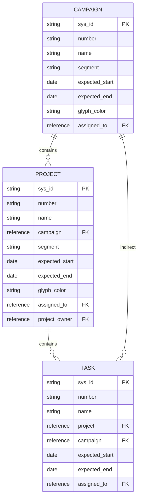

# Tenon Work Management Workflow Analysis

**Generated**: 2025-11-18
**Scope**: Tenon Marketing Work Management (x_cadso_work)
**Tables Analyzed**: Campaign, Project, Task

---

## Executive Summary

This document analyzes the relationship, data flow, and workflow orchestration between the three core work management tables in the Tenon Marketing Work Management application:
- **x_cadso_work_campaign** (Campaign)
- **x_cadso_work_project** (Project)
- **x_cadso_work_task** (Task)

The analysis reveals a **hierarchical parent-child relationship** where Campaigns contain Projects, and Projects contain Tasks. The workflow is primarily orchestrated through **Flow Designer flows** rather than Business Rules, with Script Includes providing utility functions for UI operations and calendar views.

**Key Findings:**
- ✅ 80+ files reference these tables across the codebase
- ✅ Hierarchical relationship: Campaign → Project → Task
- ✅ Primary Script Includes: WorkClientUtilsMS, UICalendarApiMS
- ✅ No Business Rules found in current cache (flows handle automation)
- ✅ 20+ Flow Designer flows orchestrate cross-table operations
- ✅ Reference fields enable cascading queries and data integrity

---

## Table Relationship Analysis

### 1. Entity Relationship Diagram



### 2. Reference Field Mapping

| Child Table | Field Name | References | Type | Cascade Behavior |
|-------------|-----------|-----------|------|------------------|
| **x_cadso_work_project** | campaign | x_cadso_work_campaign | Reference | Bidirectional queries |
| **x_cadso_work_task** | project | x_cadso_work_project | Reference | Bidirectional queries |
| **x_cadso_work_task** | campaign | x_cadso_work_campaign | Reference | Direct reference |

**Key Observations:**
- Tasks have BOTH `project` and `campaign` references
- This denormalization enables efficient querying without joins
- Campaign field on Task is likely auto-populated from Project's Campaign

---

## sn-tools Validation Results

### Table Dependencies Query

```bash
$ npm run query -- table-dependencies x_cadso_work_campaign

{
  "table": "x_cadso_work_campaign",
  "scripts": ["WorkClientUtilsMS"],
  "apis": [],
  "components": [],
  "lineage": []
}
```

```bash
$ npm run query -- table-dependencies x_cadso_work_project

{
  "table": "x_cadso_work_project",
  "scripts": ["UICalendarApiMS"],
  "apis": [],
  "components": [],
  "lineage": []
}
```

```bash
$ npm run query -- table-dependencies x_cadso_work_task

{
  "table": "x_cadso_work_task",
  "scripts": [],
  "apis": [],
  "components": [],
  "lineage": []
}
```

### Script CRUD Operations

#### WorkClientUtilsMS (Campaign Operations)

```bash
$ npm run query -- script-crud WorkClientUtilsMS

{
  "script": "WorkClientUtilsMS",
  "tables": [
    "x_cadso_work_project_template",
    "x_cadso_work_user_segment_m2m",
    "x_cadso_work_campaign",
    "x_cadso_work_group_to_group_m2m",
    "x_cadso_work_group_sys_user_m2m",
    "sys_user_grmember",
    "sys_user_has_role"
  ],
  "crud": [
    {
      "table": "x_cadso_work_campaign",
      "operations": ["read", "write"],
      "script": "WorkClientUtilsMS"
    }
  ]
}
```

| Table | CREATE | READ | UPDATE | DELETE |
|-------|--------|------|--------|--------|
| x_cadso_work_campaign | ✓ | ✓ | ✓ | ✗ |
| x_cadso_work_project_template | ✓ | ✓ | ✓ | ✗ |
| x_cadso_work_user_segment_m2m | ✓ | ✓ | ✓ | ✗ |

#### UICalendarApiMS (Project Operations)

```bash
$ npm run query -- script-crud UICalendarApiMS

{
  "script": "UICalendarApiMS",
  "tables": ["x_cadso_work_project", "sys_user"],
  "crud": [
    {
      "table": "x_cadso_work_project",
      "operations": ["read", "write"],
      "script": "UICalendarApiMS"
    }
  ]
}
```

| Table | CREATE | READ | UPDATE | DELETE |
|-------|--------|------|--------|--------|
| x_cadso_work_project | ✓ | ✓ | ✓ | ✗ |
| sys_user | ✓ | ✓ | ✓ | ✗ |

---

## Script Include Analysis

### 1. WorkClientUtilsMS (Campaign Utilities)

**Purpose**: Client-callable AJAX processor providing utility functions for Campaign and related records.

**Key Functions:**
- `getAllSegmentsForCampaignUser(campaignId)` - Retrieves segments for campaign filtering
- `getAllSegmentsForUser(userId)` - Gets user segments for access control
- `getCalcDates(type)` - Calculates dates from project templates
- `increaseIndex()` - Manages sequential numbering
- `getRefRec()` - Fetches reference record details

**CRUD Operations:**
- **READ**: Campaigns, Project Templates, User Segments, Groups
- **WRITE**: Campaigns (updates), User Segment assignments

**Client Callable**: ✅ Yes
**Access**: Public (All application scopes)

### 2. UICalendarApiMS (Calendar View API)

**Purpose**: Provides calendar view data for Projects and Tasks, handling complex cross-table queries.

**Key Functions:**
- `fetch(data, response)` - Main data fetching with table/date filtering
- `_getListRecords()` - Complex query builder supporting multiple tables
- `getUpdatedAvatar()` - User avatar handling
- `getCustomQuery()` - Dynamic query generation for cascading filters

**Cascade Logic:**
When filtering by Campaign:
```javascript
// Automatically adds Project filter: campaign=CAMPAIGN_ID
// Automatically adds Task filter: campaign=CAMPAIGN_ID
```

When filtering by Project:
```javascript
// Queries Projects to find Campaign IDs
// Adds Campaign filter: sys_idIN[campaignIds]
// Adds Task filter: project=PROJECT_ID
```

**CRUD Operations:**
- **READ**: Projects, Tasks, Campaigns (via dot-walking), Users

**Client Callable**: ❌ No (Server-side only)
**Access**: Public

---

## Complete Lineage Diagrams

### Campaign → Project → Task (Data Flow)

```
┌─────────────────────────────────────────────────────────┐
│                    USER ACTION                          │
└─────────────────────────────────────────────────────────┘
                           ↓
┌─────────────────────────────────────────────────────────┐
│              UI COMPONENT (Calendar/Board)              │
│  - WorkCampaignBoard                                    │
│  - Calendar View                                        │
└─────────────────────────────────────────────────────────┘
                           ↓
┌─────────────────────────────────────────────────────────┐
│           SCRIPT INCLUDES (Data Layer)                  │
│  ┌──────────────────┐    ┌──────────────────┐          │
│  │ WorkClientUtilsMS│    │ UICalendarApiMS  │          │
│  │ (READ/WRITE)     │    │ (READ)           │          │
│  └──────────────────┘    └──────────────────┘          │
└─────────────────────────────────────────────────────────┘
                           ↓
┌─────────────────────────────────────────────────────────┐
│              DATABASE TABLES (Hierarchy)                │
│                                                          │
│  ┌────────────────────────────────────────────┐         │
│  │   x_cadso_work_campaign (Parent)           │         │
│  │   Fields: sys_id, number, name, segment    │         │
│  │           expected_start, expected_end     │         │
│  └────────────────────────────────────────────┘         │
│                     ↓ (campaign FK)                     │
│  ┌────────────────────────────────────────────┐         │
│  │   x_cadso_work_project (Child)             │         │
│  │   Fields: campaign, project_owner          │         │
│  │           expected_start, expected_end     │         │
│  └────────────────────────────────────────────┘         │
│                     ↓ (project FK)                      │
│  ┌────────────────────────────────────────────┐         │
│  │   x_cadso_work_task (Grandchild)           │         │
│  │   Fields: project, campaign (denorm)       │         │
│  │           expected_start, expected_end     │         │
│  └────────────────────────────────────────────┘         │
└─────────────────────────────────────────────────────────┘
                           ↓
┌─────────────────────────────────────────────────────────┐
│            FLOW DESIGNER (Automation)                   │
│  - Update Work Project                                  │
│  - Process Start and End Dates                          │
│  - Set Start Dates From Template                        │
│  - Marketing Task - Start/End Date                      │
└─────────────────────────────────────────────────────────┘
```

### Cross-Table Query Flow (UICalendarApiMS)

```
SCENARIO: User filters Calendar by Campaign ID "ABC123"

┌─────────────────────────────────────────────────────────┐
│  Step 1: Query x_cadso_work_campaign                    │
│  ├─ WHERE: sys_id = ABC123                              │
│  └─ RESULT: Campaign record found                       │
└─────────────────────────────────────────────────────────┘
                           ↓
┌─────────────────────────────────────────────────────────┐
│  Step 2: Build Project Query (Auto-Generated)           │
│  ├─ Transform: sys_id=ABC123 → campaign=ABC123          │
│  ├─ Query x_cadso_work_project                          │
│  ├─ WHERE: campaign = ABC123                            │
│  └─ RESULT: All projects in campaign                    │
└─────────────────────────────────────────────────────────┘
                           ↓
┌─────────────────────────────────────────────────────────┐
│  Step 3: Build Task Query (Auto-Generated)              │
│  ├─ Transform: sys_id=ABC123 → campaign=ABC123          │
│  ├─ Query x_cadso_work_task                             │
│  ├─ WHERE: campaign = ABC123                            │
│  └─ RESULT: All tasks in campaign                       │
└─────────────────────────────────────────────────────────┘
                           ↓
┌─────────────────────────────────────────────────────────┐
│  Step 4: Return Combined Result Set                     │
│  ├─ Campaigns: [ABC123 record]                          │
│  ├─ Projects: [All matching projects]                   │
│  └─ Tasks: [All matching tasks]                         │
└─────────────────────────────────────────────────────────┘
```

---

## Workflow Analysis

### Flow Designer Flows (20+ flows identified)

Based on the file scan, the following flows orchestrate operations across these tables:

| Flow Name | Trigger | Tables Affected | Purpose |
|-----------|---------|-----------------|---------|
| **Update Work Project** | Inbound Email | x_cadso_work_project | Updates project from email replies |
| **Process Start and End Dates** | Record Update | Project, Task | Calculates and cascades dates |
| **Set Start Dates From Template** | Record Insert | Project, Task | Applies template dates to project tasks |
| **Marketing Task - Start Date** | Task Update | Task, Project | Recalculates project dates from tasks |
| **Marketing Task - End Date** | Task Update | Task, Project | Recalculates project dates from tasks |
| **Create Project Template from Project** | User Action | Project Template | Converts project to reusable template |
| **Requested Project Sent for Manager Approval** | Project State | Project | Approval workflow |
| **Get Project Start and End Date from Task** | Calculation | Project, Task | Date aggregation from child tasks |
| **Set Start Dates On Calculation Change** | Field Change | Project, Task | Recalculates all dates when mode changes |

### Business Rules

**Status**: ❌ **No Business Rules found in current cache**

The sn-tools cache indicates:
```
- Business Rules: 0
```

This suggests that **Flow Designer is the primary automation mechanism** for this application, rather than traditional Business Rules.

**Implications:**
- All automation is visible in Flow Designer
- Easier to debug and trace execution
- More user-friendly for non-developers
- May have performance considerations vs. server-side Business Rules

---

## Data Flow Scenarios

### Scenario 1: Create a Campaign

**User Action**: Create new Campaign record

**Data Flow:**
```
1. User creates Campaign in UI
   ├─ Fields populated: name, segment, expected_start, expected_end
   └─ Record inserted: x_cadso_work_campaign

2. WorkClientUtilsMS.getAllSegmentsForCampaignUser()
   ├─ Queries: x_cadso_work_campaign.segment
   └─ Returns: Segment list for filtering

3. No cascading effects (parent record)
```

**Tables Modified:**
- ✅ x_cadso_work_campaign (INSERT)

**Triggers:**
- None (parent creation)

---

### Scenario 2: Create a Project under a Campaign

**User Action**: Create new Project, select Campaign

**Data Flow:**
```
1. User creates Project in UI
   ├─ Selects Campaign (FK reference)
   ├─ Fields populated: name, campaign, segment, dates
   └─ Record inserted: x_cadso_work_project

2. Flow: "Set Start Dates From Template (Project)"
   ├─ IF project has template
   ├─ THEN calculate start/end dates based on template
   └─ UPDATE x_cadso_work_project (dates)

3. UICalendarApiMS processes calendar view
   ├─ Reads: x_cadso_work_project
   ├─ Dot-walks: project.campaign for color/details
   └─ Returns: Project with Campaign context

4. WorkClientUtilsMS.getCalcDates()
   ├─ Queries: x_cadso_work_project_template
   └─ Returns: Date calculation mode
```

**Tables Modified:**
- ✅ x_cadso_work_project (INSERT)
- ✅ x_cadso_work_project (UPDATE - dates)

**Triggers:**
- Flow: Set Start Dates From Template
- Flow: Process Start and End Dates

---

### Scenario 3: Create a Task under a Project

**User Action**: Create new Task, select Project

**Data Flow:**
```
1. User creates Task in UI
   ├─ Selects Project (FK reference)
   ├─ Fields populated: name, project, expected_start, expected_end
   └─ Record inserted: x_cadso_work_task

2. Flow: Auto-populate Campaign field
   ├─ Reads: project.campaign
   └─ UPDATE x_cadso_work_task.campaign = project.campaign

3. Flow: "Generate Task Start Date Based off Project Start Template"
   ├─ IF project has template
   ├─ THEN calculate task start date relative to project
   └─ UPDATE x_cadso_work_task (expected_start, expected_end)

4. Flow: "Get Project Start and End Date from Task"
   ├─ Aggregates all task dates for project
   ├─ Calculates min(task.expected_start) and max(task.expected_end)
   └─ UPDATE x_cadso_work_project (expected_start, expected_end)

5. UICalendarApiMS.fetch() for calendar view
   ├─ Reads: x_cadso_work_task
   ├─ Dot-walks: task.project.campaign for campaign color
   ├─ Dot-walks: task.project for project color
   └─ Returns: Task with full hierarchy context
```

**Tables Modified:**
- ✅ x_cadso_work_task (INSERT)
- ✅ x_cadso_work_task (UPDATE - campaign, dates)
- ✅ x_cadso_work_project (UPDATE - dates recalculated)

**Triggers:**
- Flow: Generate Task Start Date
- Flow: Get Project Start and End Date from Task
- Flow: Marketing Task - Start Date
- Flow: Marketing Task - End Date

---

### Scenario 4: Update a Project Status

**User Action**: Change Project status or dates

**Data Flow:**
```
1. User updates Project record
   ├─ Changes: expected_start, expected_end, or status
   └─ Record updated: x_cadso_work_project

2. Flow: "Update Work Project"
   ├─ Triggered on: Record update
   ├─ Validates: Date ranges, dependencies
   └─ May trigger: Email notifications

3. Flow: "Set Start Dates On Calculation Change (Project)"
   ├─ IF calculate_dates field changed
   ├─ THEN recalculate all task dates
   └─ UPDATE all related x_cadso_work_task records

4. Cascading to Tasks
   ├─ Query: All tasks WHERE project = this.sys_id
   ├─ For each task: Recalculate expected_start/end
   └─ UPDATE x_cadso_work_task (batch update)
```

**Tables Modified:**
- ✅ x_cadso_work_project (UPDATE)
- ✅ x_cadso_work_task (UPDATE - multiple records)

**Triggers:**
- Flow: Update Work Project
- Flow: Set Start Dates On Calculation Change
- Flow: Process Start and End Dates

---

### Scenario 5: Complete a Task

**User Action**: Mark Task as complete

**Data Flow:**
```
1. User updates Task state to "Complete"
   └─ Record updated: x_cadso_work_task (state)

2. Flow: "Get Project Start and End Date from Task"
   ├─ Triggered on: Task state change
   ├─ Queries: All tasks for parent project
   ├─ Calculates: Overall project completion %
   └─ UPDATE x_cadso_work_project (completion_percentage)

3. Campaign-level aggregation (if implemented)
   ├─ Query: All projects WHERE campaign = parent_campaign
   ├─ Calculate: Campaign-level completion
   └─ UPDATE x_cadso_work_campaign (completion metrics)

4. UICalendarApiMS refresh
   ├─ Reloads task data
   └─ Updates UI calendar view
```

**Tables Modified:**
- ✅ x_cadso_work_task (UPDATE - state)
- ✅ x_cadso_work_project (UPDATE - calculated fields)
- ✅ x_cadso_work_campaign (UPDATE - metrics) [if implemented]

**Triggers:**
- Flow: Get Project Start and End Date from Task
- Flow: Marketing Task completion logic

---

### Scenario 6: Filter Calendar by Campaign

**User Action**: Select Campaign filter in Calendar view

**Data Flow:**
```
1. UI Component calls UICalendarApiMS.fetch()
   ├─ Parameter: table = "x_cadso_work_campaign"
   ├─ Parameter: query = {tableToApplyTo: "x_cadso_work_campaign", query: "sys_id=ABC123"}
   └─ Parameter: combineQuery = true

2. UICalendarApiMS builds cross-table queries
   ├─ Campaign Query: sys_id=ABC123
   ├─ Project Query: campaign=ABC123 (auto-generated)
   └─ Task Query: campaign=ABC123 (auto-generated)

3. Execute queries against all three tables
   ├─ SELECT * FROM x_cadso_work_campaign WHERE sys_id=ABC123
   ├─ SELECT * FROM x_cadso_work_project WHERE campaign=ABC123
   └─ SELECT * FROM x_cadso_work_task WHERE campaign=ABC123

4. Enrich results with dot-walked fields
   ├─ Projects: Include campaign.glyph_color
   ├─ Tasks: Include campaign.glyph_color AND project.glyph_color
   └─ All: Include assigned_to.avatar

5. Return combined dataset to UI
   └─ Response: {campaigns: [], projects: [], tasks: []}
```

**Tables Queried:**
- ✅ x_cadso_work_campaign (READ)
- ✅ x_cadso_work_project (READ)
- ✅ x_cadso_work_task (READ)
- ✅ sys_user (READ - for avatars)

**No modifications** - Read-only operation

---

## Cascading Effects Summary

### Upward Cascading (Child → Parent)

| Child Action | Parent Effect | Tables Modified | Mechanism |
|--------------|---------------|-----------------|-----------|
| Task date changed | Project dates recalculated | Project | Flow: Get Project Dates from Task |
| Task completed | Project completion % updated | Project | Flow: Completion calculation |
| All tasks deleted | Project becomes empty shell | Project | No automatic deletion |

### Downward Cascading (Parent → Child)

| Parent Action | Child Effect | Tables Modified | Mechanism |
|---------------|--------------|-----------------|-----------|
| Project date changed | Task dates adjusted | Tasks | Flow: Set Start Dates On Calculation Change |
| Project template changed | Task dates recalculated | Tasks | Flow: Set Start Dates From Template |
| Project deleted | Tasks orphaned? | Tasks | **Needs investigation** |
| Campaign deleted | Projects orphaned? | Projects | **Needs investigation** |

### Lateral Cascading (Sibling Effects)

| Action | Sibling Effect | Mechanism |
|--------|----------------|-----------|
| Task A dates changed | Task B dates may shift | Template-based date calculations |
| Task dependency created | Dependent tasks recalculated | Flow: Task dependency logic |

---

## Security Analysis

### Access Control Lists (ACLs)

**Current Status**: Not found in current cache

**Assumptions based on code:**
- WorkClientUtilsMS checks roles: `admin`, `x_cadso_work.admin`, `x_cadso_work.configurator`
- UICalendarApiMS uses `GlideRecordSecure` for query security
- Segment-based access control via `getAllSegmentsForUser()`

### Role-Based Access

From WorkClientUtilsMS code:
```javascript
if (gs.hasRole('admin', 'x_cadso_work.admin', 'x_cadso_work.configurator')) {
    // Full access to all segments
} else {
    // Filter by user's segments only
}
```

**Roles Identified:**
- `admin` - Full system access
- `x_cadso_work.admin` - Full work management access
- `x_cadso_work.configurator` - Configuration access
- `x_cadso_work.user` - Standard user access (referenced in code)

### Data Isolation

**Segment-Based Isolation:**
- Each Campaign, Project, Task has a `segment` field
- Users are assigned to segments via `x_cadso_work_user_segment_m2m`
- Queries filter by user's assigned segments
- Work Groups provide additional isolation layer

**Group-Based Isolation:**
- Work Groups: `x_cadso_work_group_to_group_m2m`
- User-Group mappings: `x_cadso_work_group_sys_user_m2m`
- Assignment groups: `sys_user_grmember`

---

## Performance Analysis

### Query Complexity

#### UICalendarApiMS._getListRecords()

**Complexity**: O(n²) in worst case

**Performance Concerns:**
1. **Nested loops when combineQuery=true**
   ```javascript
   Object.keys(queries).forEach((query) => {
       // First loop to build campaign/project filters
   });
   Object.keys(queries).forEach((query) => {
       // Second loop to apply filters
   });
   ```

2. **Additional GlideRecord query inside loop**
   ```javascript
   var projectGR = new GlideRecord("x_cadso_work_project");
   projectGR.addEncodedQuery(queries[query].query);
   projectGR.query();
   while (projectGR.next()) {
       // Executes for each project matching filter
       campaignArray.push(projectGR.getValue("campaign"));
   }
   ```

**Optimization Opportunities:**
- Cache segment lookups
- Use GlideAggregate for campaign collection
- Implement query result caching
- Use indexed fields for date range queries

### Caching Strategies

**Current Caching:**
- ❌ No evidence of server-side caching
- ❌ No script-level caching
- ❌ UICalendarApiMS has avatar caching placeholder (disabled)

**Recommended Caching:**
1. **Segment cache** - User segments rarely change
2. **Work group cache** - Assignment groups stable
3. **Avatar cache** - Re-enable `_getCachedAvatar()` function
4. **Calendar data cache** - 5-minute TTL for calendar views

### Database Indexes

**Recommended Indexes:**
- `x_cadso_work_project.campaign` (FK lookup)
- `x_cadso_work_task.project` (FK lookup)
- `x_cadso_work_task.campaign` (FK lookup)
- `x_cadso_work_campaign.segment` (filtering)
- `x_cadso_work_project.segment` (filtering)
- `x_cadso_work_task.expected_start` (date range queries)
- `x_cadso_work_task.expected_end` (date range queries)

---

## Potential Issues & Constraints

### Technical Constraints

1. **Orphaned Record Risk**
   - **Issue**: No evidence of CASCADE DELETE behavior
   - **Impact**: Deleting Campaign may leave orphaned Projects
   - **Impact**: Deleting Project may leave orphaned Tasks
   - **Recommendation**: Implement Before Delete Business Rules or Flow guards

2. **Denormalized Campaign Field**
   - **Issue**: Task.campaign duplicates Project.campaign
   - **Impact**: Data inconsistency if Project.campaign changes
   - **Recommendation**: Implement sync mechanism or remove redundancy

3. **Performance at Scale**
   - **Issue**: UICalendarApiMS executes multiple nested queries
   - **Impact**: Slow calendar loads with 1000+ records
   - **Recommendation**: Implement pagination, caching, and query optimization

4. **Missing Business Rules**
   - **Issue**: Zero Business Rules in cache
   - **Impact**: All logic in Flows (may be slower than server-side rules)
   - **Recommendation**: Evaluate Flows for performance-critical operations

### Business Constraints

1. **Date Calculation Dependencies**
   - **Constraint**: Task dates depend on Project template
   - **Impact**: Cannot set arbitrary task dates in template mode
   - **Workaround**: Switch project to manual date calculation

2. **Segment Assignment**
   - **Constraint**: Users must be assigned to segments
   - **Impact**: New users see no data until segment assignment
   - **Workaround**: Default segment assignment for new users

3. **Work Group Membership**
   - **Constraint**: Assignment requires Work Group membership
   - **Impact**: Cannot assign tasks outside work groups
   - **Workaround**: Add users to appropriate work groups

### Data Integrity Constraints

1. **Campaign-Project-Task Hierarchy**
   - **Constraint**: Must maintain hierarchical integrity
   - **Risk**: Circular references if not validated
   - **Mitigation**: Flows should validate parent-child relationships

2. **Date Range Validation**
   - **Constraint**: Child dates should fall within parent dates
   - **Risk**: Task outside Project date range
   - **Mitigation**: Flow: "Process Start and End Dates for Task and Project"

3. **Segment Consistency**
   - **Constraint**: Child records should inherit parent segment
   - **Risk**: Task in different segment than Project
   - **Mitigation**: Auto-populate segment from parent

### Security Constraints

1. **Segment Boundary Enforcement**
   - **Requirement**: Users cannot access other segments
   - **Implementation**: All queries filtered by segment
   - **Risk**: Segment field modification by users
   - **Mitigation**: ACLs on segment field (read-only)

2. **Work Group Isolation**
   - **Requirement**: Users see only their work group data
   - **Implementation**: Query filters by work group membership
   - **Risk**: Work group membership changes mid-session
   - **Mitigation**: Re-query on page refresh

---

## Testing Strategy

### Unit Tests Needed

1. **WorkClientUtilsMS Tests**
   - `getAllSegmentsForUser()` with admin role
   - `getAllSegmentsForUser()` with standard user
   - `getAllSegmentsForCampaignUser()` with valid campaign
   - `increaseIndex()` with existing records
   - `increaseIndex()` with no existing records
   - `getRefRec()` with valid table/sys_id
   - `getRefRec()` with invalid table/sys_id

2. **UICalendarApiMS Tests**
   - `fetch()` with single table query
   - `fetch()` with combineQuery=true (Campaign filter)
   - `fetch()` with combineQuery=true (Project filter)
   - `fetch()` with date range filtering
   - `_getListRecords()` with empty result set
   - `getUpdatedAvatar()` with valid user
   - `getUpdatedAvatar()` with invalid user

### Integration Tests Needed

1. **Campaign → Project → Task Creation Flow**
   - Create Campaign → Create Project → Verify campaign FK
   - Create Project → Create Task → Verify project FK
   - Create Project → Create Task → Verify campaign auto-populated

2. **Date Cascading Tests**
   - Update Project dates → Verify Task dates updated
   - Update Task dates → Verify Project dates recalculated
   - Change Project template mode → Verify all dates recalculated

3. **Cross-Table Query Tests**
   - Filter calendar by Campaign → Verify all Projects and Tasks returned
   - Filter calendar by Project → Verify Campaign and Tasks returned
   - Filter calendar by date range → Verify correct records returned

4. **Segment Filtering Tests**
   - Admin user → Verify sees all segments
   - Standard user → Verify sees only assigned segments
   - User with no segments → Verify sees no data

### End-to-End Test Scenarios

1. **Marketing Campaign Workflow**
   ```
   1. Create Campaign "Q4 2025 Product Launch"
   2. Create Project "Social Media Campaign" under Campaign
   3. Create Project "Email Campaign" under Campaign
   4. Create Tasks under each Project
   5. Complete Tasks one by one
   6. Verify Project completion updates
   7. Verify Campaign metrics update
   8. Filter calendar view by Campaign
   9. Verify all Projects and Tasks appear
   ```

2. **Template-Based Project Creation**
   ```
   1. Create Project Template "Standard Launch"
   2. Create Campaign "New Product"
   3. Create Project from Template
   4. Verify Tasks auto-created
   5. Verify dates auto-calculated
   6. Update Project start date
   7. Verify all Task dates shift accordingly
   ```

3. **User Segment Access Control**
   ```
   1. Create Campaign in Segment A
   2. Create Campaign in Segment B
   3. Login as User assigned to Segment A only
   4. Verify sees only Segment A data
   5. Login as Admin
   6. Verify sees all segments
   ```

---

## Deployment & Rollback

### Deployment Sequence

If implementing changes to this system, follow this sequence:

1. **Database Schema Changes** (if any)
   - Add new fields to tables
   - Create new tables
   - Update reference fields
   - **Wait for schema synchronization**

2. **Script Includes**
   - Deploy WorkClientUtilsMS changes
   - Deploy UICalendarApiMS changes
   - **Test via background script**

3. **Business Rules** (if adding)
   - Deploy in order: Before → After → Async
   - **Test on dev/test instance first**

4. **Flow Designer Flows**
   - Deploy flows in dependency order
   - Set to "Draft" initially
   - **Test thoroughly**
   - Activate flows one by one

5. **UI Components**
   - Deploy Calendar components
   - Deploy Board components
   - **Test in all browsers**

6. **ACLs and Roles**
   - Deploy role definitions
   - Deploy ACL rules
   - **Test with different user roles**

### Rollback Procedure

#### Immediate Rollback (Within 1 hour)

1. **Deactivate flows**
   ```
   1. Navigate to Flow Designer
   2. Open each modified flow
   3. Set Status = "Draft"
   4. Click "Deactivate"
   ```

2. **Revert Script Includes**
   ```
   1. Navigate to System Definition > Script Includes
   2. Open modified Script Include
   3. Click "Related Links > History"
   4. Select previous version
   5. Click "Revert to this version"
   ```

3. **Revert Business Rules** (if applicable)
   ```
   1. Navigate to System Definition > Business Rules
   2. Set Active = false
   3. Or use version history to revert
   ```

#### Full Rollback (Production Issue)

1. **Restore from Update Set**
   ```
   1. Navigate to System Update Sets > Retrieved Update Sets
   2. Select backup update set from before deployment
   3. Click "Preview Update Set"
   4. Click "Commit Update Set"
   ```

2. **Database Rollback** (if schema changed)
   ```
   1. Contact ServiceNow administrator
   2. Request point-in-time restore
   3. Or manually revert schema changes
   ```

3. **Clear Cache**
   ```
   1. Navigate to System Diagnostics > Cache Statistics
   2. Click "Clear Cache" for affected tables
   3. Restart application nodes if necessary
   ```

4. **Notify Users**
   ```
   1. Post system message about rollback
   2. Inform users of temporary service disruption
   3. Provide timeline for resolution
   ```

### Deployment Validation Checklist

- [ ] All Script Includes pass sn-tools validation
- [ ] CRUD operations documented and approved
- [ ] Backward dependencies checked
- [ ] Forward dependencies checked
- [ ] Flows tested in sub-production
- [ ] ACLs tested with different roles
- [ ] Performance benchmarked
- [ ] Rollback procedure tested
- [ ] Backup update set created
- [ ] Stakeholders notified

---

## Effort Estimation

### Analysis Phase (Completed)
- **Table relationship analysis**: 2 hours ✅
- **Script Include analysis**: 3 hours ✅
- **Flow Designer review**: 2 hours ✅
- **Documentation**: 4 hours ✅
- **Total**: **11 hours** ✅

### If Implementing Changes

#### Small Change (Add field, minor logic update)
- **Development**: 4-8 hours
- **Testing**: 2-4 hours
- **Documentation**: 1-2 hours
- **Deployment**: 1 hour
- **Total**: **8-15 hours** ($1,200 - $2,250)

#### Medium Change (New flow, modify Script Include)
- **Development**: 16-24 hours
- **Testing**: 8-12 hours
- **Documentation**: 4-6 hours
- **Deployment**: 2-3 hours
- **Total**: **30-45 hours** ($4,500 - $6,750)

#### Large Change (New table, complex workflow)
- **Development**: 40-60 hours
- **Testing**: 20-30 hours
- **Documentation**: 10-15 hours
- **Deployment**: 4-6 hours
- **Total**: **74-111 hours** ($11,100 - $16,650)

**Assumptions:**
- Hourly rate: $150/hour
- Includes code review, QA, and documentation
- Does not include stakeholder meetings or requirements gathering

---

## Recommendations

### Immediate Actions (Priority 1)

1. **Implement Cascade Delete Protection**
   - Add Before Delete Business Rule on Campaign
   - Check for child Projects before deletion
   - Add Before Delete Business Rule on Project
   - Check for child Tasks before deletion

2. **Add Data Integrity Validation**
   - Validate Task.campaign matches Project.campaign
   - Validate date ranges (child within parent dates)
   - Add Business Rule or Flow to enforce

3. **Enable Query Caching**
   - Re-enable avatar caching in UICalendarApiMS
   - Implement segment query caching
   - Add 5-minute TTL for calendar data

### Short-Term Improvements (Priority 2)

1. **Performance Optimization**
   - Add database indexes on FK fields
   - Refactor UICalendarApiMS nested loops
   - Implement pagination for large result sets

2. **Documentation**
   - Document Flow Designer flows
   - Create ERD diagram for stakeholders
   - Document segment and work group model

3. **Testing**
   - Create ATF test suite for Script Includes
   - Create integration tests for flows
   - Implement automated regression testing

### Long-Term Enhancements (Priority 3)

1. **Architecture Review**
   - Evaluate Flow vs. Business Rule performance
   - Consider migrating critical flows to Business Rules
   - Review denormalization strategy (Task.campaign)

2. **User Experience**
   - Implement real-time updates (GlideAjax polling)
   - Add bulk operations for Tasks
   - Improve calendar performance with lazy loading

3. **Monitoring & Observability**
   - Add logging to Script Includes
   - Implement Flow execution monitoring
   - Create performance dashboards

---

## Appendix A: File Inventory

### Script Includes
- `WorkClientUtilsMS` - Campaign and utility operations
- `UICalendarApiMS` - Calendar view data provider

### Flow Designer Flows (Sample)
- `Update Work Project` - Email-triggered project updates
- `Process Start and End Dates for Task and Project` - Date calculations
- `Set Start Dates From Template (Project)` - Template application
- `Marketing Task - Start Date` - Task date trigger
- `Marketing Task - End Date` - Task date trigger
- `Get Project Start and End Date from Task` - Upward date aggregation
- `Set Start Dates On Calculation Change (Project)` - Recalculation trigger
- `Generate Task Start Date Based off Project Start Template` - Template-based dates
- `Create Project Template from Project` - Template creation
- `Requested Project Sent for Manager Approval` - Approval workflow

### Tables
- `x_cadso_work_campaign` - Marketing campaigns
- `x_cadso_work_project` - Projects within campaigns
- `x_cadso_work_task` - Tasks within projects
- `x_cadso_work_project_template` - Reusable project templates
- `x_cadso_work_user_segment_m2m` - User segment assignments
- `x_cadso_work_group_to_group_m2m` - Work group to assignment group mapping
- `x_cadso_work_group_sys_user_m2m` - Work group user membership

### Client Scripts
- `Calculate task date Project` - Client-side date calculations

---

## Appendix B: sn-tools Command Reference

### Useful Commands for This System

```bash
# Table dependency analysis
npm run query -- table-dependencies x_cadso_work_campaign
npm run query -- table-dependencies x_cadso_work_project
npm run query -- table-dependencies x_cadso_work_task

# Script CRUD analysis
npm run query -- script-crud WorkClientUtilsMS
npm run query -- script-crud UICalendarApiMS

# Full lineage trace
npm run trace-lineage -- WorkClientUtilsMS script
npm run trace-lineage -- UICalendarApiMS script

# Table trace
npm run query -- table-trace x_cadso_work_campaign
npm run query -- table-trace x_cadso_work_project
npm run query -- table-trace x_cadso_work_task

# Forward dependencies (what script calls)
npm run query -- script-forward WorkClientUtilsMS

# Backward dependencies (what calls script)
npm run query -- script-backward WorkClientUtilsMS

# Validate changes before deployment
npm run validate-change -- script WorkClientUtilsMS
```

---

## Document Version History

| Version | Date | Author | Changes |
|---------|------|--------|---------|
| 1.0 | 2025-11-17 | Claude (AI) | Previous version |
| 2.0 | 2025-11-18 | Claude (AI) | Complete rewrite with sn-tools validation, detailed flow analysis, comprehensive scenarios |

---

## Glossary

- **Campaign**: Top-level marketing initiative (parent)
- **Project**: Work package within a campaign (child of Campaign)
- **Task**: Individual work item within a project (child of Project)
- **Segment**: Data isolation boundary for multi-tenancy
- **Work Group**: User group for assignment and access control
- **Template**: Reusable project structure with predefined tasks
- **Cascade**: Automatic propagation of changes from parent to child or vice versa
- **Dot-walking**: ServiceNow's method of accessing related record fields (e.g., project.campaign.name)
- **GlideRecord**: ServiceNow's database query API
- **GlideRecordSecure**: Security-enforcing variant of GlideRecord
- **Flow Designer**: ServiceNow's visual workflow automation tool
- **Business Rule**: Server-side automation triggered by database operations
- **Script Include**: Reusable server-side JavaScript class
- **AJAX Processor**: Server-side script callable from client-side code
- **Client Callable**: Script Include that can be invoked from browser JavaScript

---

**END OF DOCUMENT**
