# x_cadso_automate_email: INSERT vs UPDATE vs DELETE Operation Analysis

**Generated:** 2026-01-13
**Table:** `x_cadso_automate_email`
**Purpose:** Compare execution contexts for different CRUD operations

---

## Executive Summary

This analysis compares the Business Rule execution contexts for INSERT, UPDATE, and DELETE operations on the `x_cadso_automate_email` table. Key findings:

| Metric | INSERT | UPDATE | DELETE |
|--------|--------|--------|--------|
| **Total Business Rules** | 11 | 10 | 1 |
| **Before Rules** | 6 | 6 | 1 |
| **After Rules** | 5 | 4 | 0 |
| **Async Rules** | 0 | 0 | 0 |
| **Risk Level** | HIGH | HIGH | LOW |

**Recommendation:** UPDATE operations are marginally safer than INSERT due to one fewer cascading effect, but both carry HIGH risk. DELETE is the safest operation but has strict restrictions.

---

## Existing System Analysis

### sn-tools Command Outputs

#### INSERT Execution Context
```bash
$ npm run cache-query -- x_cadso_automate_email insert

{
  "found": true,
  "table": "x_cadso_automate_email",
  "operation": "insert",
  "businessRules": [
    {
      "name": "Set Audience Tables",
      "timing": "before",
      "order": -100,
      "condition": "sourcesVALCHANGES^EQ"
    },
    {
      "name": "Update HTML and JSON on Template Change",
      "timing": "before",
      "order": 80,
      "condition": "templateISNOTEMPTY^EQ"
    },
    {
      "name": "Enable Save Changes",
      "timing": "before",
      "order": 100,
      "condition": "Always runs"
    },
    {
      "name": "Set Published Date",
      "timing": "before",
      "order": 100,
      "condition": "Always runs"
    },
    {
      "name": "Status and State Sync",
      "timing": "before",
      "order": 100,
      "condition": "statusVALCHANGES^EQ"
    },
    {
      "name": "Update Can Edit",
      "timing": "before",
      "order": 100,
      "condition": "stateVALCHANGES^EQ"
    },
    {
      "name": "Create Email Send",
      "timing": "after",
      "order": 100,
      "condition": "Always runs"
    },
    {
      "name": "Create Email Send (A/B Testing)",
      "timing": "after",
      "order": 101,
      "condition": "enable_a_b_testing=true^enable_a_b_testingVALCHANGES^version_bISEMPTY^EQ"
    },
    {
      "name": "Update Email Sends Status",
      "timing": "after",
      "order": 333,
      "condition": "statusVALCHANGES^type=automated^EQ"
    },
    {
      "name": "Update Email Send Type",
      "timing": "after",
      "order": 334,
      "condition": "typeVALCHANGES^EQ"
    },
    {
      "name": "Update Email Send Content",
      "timing": "after",
      "order": 900,
      "condition": "htmlVALCHANGES^ORjsonVALCHANGES^statusINinitialized,draft^EQ"
    }
  ],
  "riskLevel": "HIGH"
}
```

#### UPDATE Execution Context
```bash
$ npm run cache-query -- x_cadso_automate_email update

{
  "found": true,
  "table": "x_cadso_automate_email",
  "operation": "update",
  "businessRules": [
    {
      "name": "Set Audience Tables",
      "timing": "before",
      "order": -100,
      "condition": "sourcesVALCHANGES^EQ"
    },
    {
      "name": "Update HTML and JSON on Template Change",
      "timing": "before",
      "order": 80,
      "condition": "templateISNOTEMPTY^EQ"
    },
    {
      "name": "Prevent Content Edits for States",
      "timing": "before",
      "order": 100,
      "condition": "htmlVALCHANGES^ORjsonVALCHANGES^can_edit=false^EQ"
    },
    {
      "name": "Set Published Date",
      "timing": "before",
      "order": 100,
      "condition": "Always runs"
    },
    {
      "name": "Status and State Sync",
      "timing": "before",
      "order": 100,
      "condition": "statusVALCHANGES^EQ"
    },
    {
      "name": "Update Can Edit",
      "timing": "before",
      "order": 100,
      "condition": "stateVALCHANGES^EQ"
    },
    {
      "name": "Create Email Send (A/B Testing)",
      "timing": "after",
      "order": 101,
      "condition": "enable_a_b_testing=true^enable_a_b_testingVALCHANGES^version_bISEMPTY^EQ"
    },
    {
      "name": "Update Email Sends Status",
      "timing": "after",
      "order": 333,
      "condition": "statusVALCHANGES^type=automated^EQ"
    },
    {
      "name": "Update Email Send Type",
      "timing": "after",
      "order": 334,
      "condition": "typeVALCHANGES^EQ"
    },
    {
      "name": "Update Email Send Content",
      "timing": "after",
      "order": 900,
      "condition": "htmlVALCHANGES^ORjsonVALCHANGES^statusINinitialized,draft^EQ"
    }
  ],
  "riskLevel": "HIGH"
}
```

#### DELETE Execution Context
```bash
$ npm run cache-query -- x_cadso_automate_email delete

{
  "found": true,
  "table": "x_cadso_automate_email",
  "operation": "delete",
  "businessRules": [
    {
      "name": "Prevent Delete",
      "timing": "before",
      "order": 100,
      "condition": "statusINqueue,sent,published^EQ"
    }
  ],
  "riskLevel": "LOW"
}
```

#### Table Dependencies
```bash
$ npm run query -- table-dependencies x_cadso_automate_email

{
  "success": true,
  "data": {
    "table": "x_cadso_automate_email",
    "script_includes": [
      {
        "name": "TenonEmailValidation",
        "api_name": "x_cadso_journey.TenonEmailValidation"
      }
    ],
    "apis": [
      {
        "name": "Sending Strategy - Save",
        "key": "Tenon Automate UI API/POST/api/x_cadso_automate/ui/sendingStrategy/save",
        "method": "POST"
      }
    ],
    "business_rule_count": 13,
    "total_affected": 15
  }
}
```

---

## Table Schema

| Field Name | Type | Description | Mandatory | Read-Only |
|------------|------|-------------|-----------|-----------|
| `archived` | boolean | Archive flag | No | No |
| `audience_tables` | glide_list | Audience Tables | No | **Yes** |
| `brand_kit` | reference | Brand Kit reference | No | No |
| `campaign` | reference | Campaign reference | No | No |
| `can_edit` | boolean | Editing permission flag | No | **Yes** |
| `can_send` | boolean | Sending permission flag | No | **Yes** |
| `enable_a_b_testing` | boolean | A/B Testing toggle | No | No |
| `html` | html | Email HTML content | No | No |
| `json` | string_full_utf8 | Email JSON structure | No | No |
| `name` | string | Email name | No | No |
| `published` | glide_date_time | Published timestamp | No | No |
| `sources` | string | Source definitions | No | No |
| `state` | string | Internal state | No | **Yes** |
| `status` | string | User-facing status | No | No |
| `template` | reference | Email template reference | No | No |
| `type` | string | Email type | No | No |
| `version_a` | reference | A/B Test Version A | No | No |
| `version_b` | reference | A/B Test Version B | No | No |

**Key Fields for Business Rule Triggering:**
- `sources` - Triggers "Set Audience Tables"
- `status` - Triggers "Status and State Sync", "Update Email Sends Status"
- `state` - Triggers "Update Can Edit"
- `html`/`json` - Triggers content-related rules
- `template` - Triggers "Update HTML and JSON on Template Change"
- `type` - Triggers "Update Email Send Type"
- `enable_a_b_testing` - Triggers A/B testing rules

---

## Side-by-Side Comparison

### Business Rules by Operation

| Business Rule | INSERT | UPDATE | DELETE | Timing | Order |
|---------------|:------:|:------:|:------:|--------|-------|
| Set Audience Tables | ✓ | ✓ | ✗ | before | -100 |
| Update HTML and JSON on Template Change | ✓ | ✓ | ✗ | before | 80 |
| Enable Save Changes | ✓ | ✗ | ✗ | before | 100 |
| Prevent Content Edits for States | ✗ | ✓ | ✗ | before | 100 |
| Set Published Date | ✓ | ✓ | ✗ | before | 100 |
| Status and State Sync | ✓ | ✓ | ✗ | before | 100 |
| Update Can Edit | ✓ | ✓ | ✗ | before | 100 |
| Prevent Delete | ✗ | ✗ | ✓ | before | 100 |
| Create Email Send | ✓ | ✗ | ✗ | after | 100 |
| Create Email Send (A/B Testing) | ✓ | ✓ | ✗ | after | 101 |
| Update Email Sends Status | ✓ | ✓ | ✗ | after | 333 |
| Update Email Send Type | ✓ | ✓ | ✗ | after | 334 |
| Update Email Send Content | ✓ | ✓ | ✗ | after | 900 |

---

## Rules Unique to INSERT

### 1. Enable Save Changes (before, order 100)
- **Condition:** Always runs
- **Purpose:** Initializes save state for new records
- **Impact:** Sets up initial editing permissions

### 2. Create Email Send (after, order 100)
- **Condition:** Always runs
- **Purpose:** Creates associated email_send record when email is created
- **Impact:** **HIGH** - Creates child records in related tables
- **Cascading Effects:**
  - Creates new records in `x_cadso_automate_email_send` table
  - Establishes parent-child relationship
  - Triggers additional business rules on email_send table

---

## Rules Unique to UPDATE

### 1. Prevent Content Edits for States (before, order 100)
- **Condition:** `htmlVALCHANGES^ORjsonVALCHANGES^can_edit=false`
- **Purpose:** Blocks content modifications when email is in non-editable state
- **Impact:** **Protective** - Prevents unauthorized changes
- **Behavior:** Aborts/reverts the update if conditions are met

---

## Rules Unique to DELETE

### 1. Prevent Delete (before, order 100)
- **Condition:** `statusINqueue,sent,published`
- **Purpose:** Prevents deletion of emails that are queued, sent, or published
- **Impact:** **Protective** - Preserves data integrity
- **Behavior:** Aborts delete operation if status is restricted

---

## Rules Common to Both INSERT and UPDATE

| Rule Name | Condition | Timing | Risk |
|-----------|-----------|--------|------|
| Set Audience Tables | sourcesVALCHANGES | before | MEDIUM |
| Update HTML and JSON on Template Change | templateISNOTEMPTY | before | LOW |
| Set Published Date | Always runs | before | LOW |
| Status and State Sync | statusVALCHANGES | before | MEDIUM |
| Update Can Edit | stateVALCHANGES | before | LOW |
| Create Email Send (A/B Testing) | enable_a_b_testing=true^... | after | HIGH |
| Update Email Sends Status | statusVALCHANGES^type=automated | after | MEDIUM |
| Update Email Send Type | typeVALCHANGES | after | LOW |
| Update Email Send Content | htmlVALCHANGES^ORjsonVALCHANGES^... | after | MEDIUM |

---

## Cascading Effects Comparison

### INSERT Cascading Effects
```
INSERT on x_cadso_automate_email
  │
  ├─[before] Set Audience Tables → Updates audience_tables field
  ├─[before] Update HTML and JSON on Template Change → May modify html/json fields
  ├─[before] Enable Save Changes → Sets initial state
  ├─[before] Set Published Date → May set published timestamp
  ├─[before] Status and State Sync → Syncs status/state fields
  ├─[before] Update Can Edit → Sets can_edit flag
  │
  ├─[after] Create Email Send → CREATES NEW RECORD in email_send table
  ├─[after] Create Email Send (A/B Testing) → May CREATE ADDITIONAL RECORDS
  ├─[after] Update Email Sends Status → Updates related email_send records
  ├─[after] Update Email Send Type → Updates related email_send records
  └─[after] Update Email Send Content → Updates related email_send records
```

### UPDATE Cascading Effects
```
UPDATE on x_cadso_automate_email
  │
  ├─[before] Set Audience Tables → Updates audience_tables field
  ├─[before] Update HTML and JSON on Template Change → May modify html/json fields
  ├─[before] Prevent Content Edits for States → MAY ABORT OPERATION
  ├─[before] Set Published Date → May update published timestamp
  ├─[before] Status and State Sync → Syncs status/state fields
  ├─[before] Update Can Edit → Updates can_edit flag
  │
  ├─[after] Create Email Send (A/B Testing) → May CREATE NEW RECORDS
  ├─[after] Update Email Sends Status → Updates related email_send records
  ├─[after] Update Email Send Type → Updates related email_send records
  └─[after] Update Email Send Content → Updates related email_send records
```

### DELETE Cascading Effects
```
DELETE on x_cadso_automate_email
  │
  └─[before] Prevent Delete → MAY ABORT OPERATION (if status is queue/sent/published)
```

---

## Security Analysis

### INSERT Security Considerations
| Aspect | Assessment | Details |
|--------|------------|---------|
| Record Creation | MEDIUM | Creates email and associated email_send records |
| Data Validation | LOW | No explicit validation beyond template check |
| Access Control | NOT ENFORCED | No ACL checks in business rules |
| Audit Trail | LIMITED | No explicit audit logging |

### UPDATE Security Considerations
| Aspect | Assessment | Details |
|--------|------------|---------|
| Content Protection | **HIGH** | "Prevent Content Edits for States" blocks unauthorized edits |
| Data Validation | LOW | No explicit validation beyond state checks |
| Access Control | PARTIAL | can_edit flag controls UI-level access |
| Audit Trail | LIMITED | No explicit audit logging |

### DELETE Security Considerations
| Aspect | Assessment | Details |
|--------|------------|---------|
| Data Protection | **HIGH** | Prevents deletion of active/sent emails |
| Cascade Prevention | UNKNOWN | No explicit handling of related records |
| Access Control | PARTIAL | Status-based restriction only |

### Security Recommendations
1. **Add ACL checks** in business rules for explicit permission validation
2. **Implement audit logging** for all CRUD operations
3. **Add cascade delete handling** for DELETE operations
4. **Consider adding approval workflow** for status transitions

---

## Performance Analysis

### INSERT Performance
| Metric | Assessment | Details |
|--------|------------|---------|
| Business Rule Count | 11 rules | HIGH overhead |
| Database Operations | Multiple INSERTs | Creates email + email_send records |
| Condition Evaluations | Mixed | 3 unconditional, 8 conditional |
| Potential Bottleneck | "Create Email Send" | Always creates child record |

### UPDATE Performance
| Metric | Assessment | Details |
|--------|------------|---------|
| Business Rule Count | 10 rules | HIGH overhead |
| Database Operations | Primarily UPDATEs | May create A/B test records |
| Condition Evaluations | Mixed | 1 unconditional, 9 conditional |
| Potential Bottleneck | Content rules | Large html/json field changes |

### DELETE Performance
| Metric | Assessment | Details |
|--------|------------|---------|
| Business Rule Count | 1 rule | LOW overhead |
| Database Operations | Single DELETE | If allowed |
| Condition Evaluations | Single condition | Status check only |
| Potential Bottleneck | None | Minimal processing |

### Performance Optimization Recommendations
1. **Index** status, state, and type fields for faster condition evaluation
2. **Consider async** for "Update Email Send Content" (order 900)
3. **Batch updates** when modifying multiple email records
4. **Cache** template content to reduce template lookups

---

## Risk Assessment

### Technical Risks

| Risk | INSERT | UPDATE | DELETE |
|------|--------|--------|--------|
| Cascading failures | **HIGH** - Creates child records | **MEDIUM** - Updates child records | **LOW** - Blocked if active |
| Data corruption | **MEDIUM** - Multiple field mutations | **MEDIUM** - Multiple field mutations | **LOW** - Abort mechanism |
| Performance degradation | **HIGH** - 11 rules execute | **HIGH** - 10 rules execute | **LOW** - 1 rule executes |
| Race conditions | **MEDIUM** - Concurrent inserts | **HIGH** - Concurrent updates | **LOW** - Typically rare |

### Business Risks

| Risk | INSERT | UPDATE | DELETE |
|------|--------|--------|--------|
| Data loss | **LOW** - Creates new data | **MEDIUM** - May overwrite content | **HIGH** - Permanent deletion |
| User experience | **MEDIUM** - Slow creation | **MEDIUM** - May block saves | **LOW** - Clear error message |
| Process disruption | **HIGH** - May create unwanted sends | **MEDIUM** - State sync issues | **LOW** - Protected states |

### Data Integrity Risks

| Risk | INSERT | UPDATE | DELETE |
|------|--------|--------|--------|
| Orphaned records | **LOW** - Parent created first | **LOW** - Referential updates | **HIGH** - Related records may remain |
| Inconsistent state | **MEDIUM** - Multi-rule mutations | **HIGH** - Concurrent edit conflicts | **LOW** - Single operation |
| Field validation | **LOW** - No mandatory fields | **MEDIUM** - Can_edit bypass | **LOW** - Status validation |

### Security Risks

| Risk | INSERT | UPDATE | DELETE |
|------|--------|--------|--------|
| Unauthorized access | **MEDIUM** - No ACL in BR | **MEDIUM** - No ACL in BR | **LOW** - Status protection |
| Data exposure | **LOW** - New record | **MEDIUM** - Content changes | **LOW** - Deletion blocked |
| Privilege escalation | **LOW** - Standard creation | **MEDIUM** - State manipulation | **LOW** - Protected |

---

## Risk Comparison Summary

| Operation | Overall Risk Level | Primary Concerns |
|-----------|-------------------|------------------|
| **INSERT** | **HIGH** | Creates child records automatically; 11 business rules; cascading effects |
| **UPDATE** | **HIGH** | 10 business rules; state synchronization; potential for race conditions |
| **DELETE** | **LOW** | Protected by status check; only 1 business rule; minimal cascading |

---

## Testing Strategy

### INSERT Testing
1. **Unit Tests:**
   - Verify email record creation with all field combinations
   - Confirm email_send child record creation
   - Test A/B testing record creation scenarios

2. **Integration Tests:**
   - Create email → verify email_send exists
   - Create email with template → verify HTML/JSON populated
   - Create email with sources → verify audience_tables populated

3. **Edge Cases:**
   - Insert with null optional fields
   - Insert with invalid template reference
   - Concurrent insert stress testing

### UPDATE Testing
1. **Unit Tests:**
   - Verify field updates propagate correctly
   - Test "Prevent Content Edits" blocking behavior
   - Confirm status/state synchronization

2. **Integration Tests:**
   - Update email → verify email_send synced
   - Update html/json → verify content propagation
   - Enable A/B testing → verify version records created

3. **Edge Cases:**
   - Update when can_edit=false
   - Concurrent update conflict handling
   - Update to trigger all conditional rules

### DELETE Testing
1. **Unit Tests:**
   - Verify deletion blocked for queue/sent/published status
   - Confirm deletion allowed for draft/initialized status

2. **Integration Tests:**
   - Delete email → verify orphan handling (if any)
   - Delete → verify audit/logging (if implemented)

3. **Edge Cases:**
   - Delete immediately after status change
   - Delete with active references

---

## Deployment & Rollback

### Deployment Considerations

When deploying changes to business rules on this table:

1. **Sequence:**
   ```
   1. Deploy before rules first (maintain data integrity)
   2. Deploy after rules second (cascading operations)
   3. Test in lower environment with all operations
   4. Deploy to production during low-usage window
   ```

2. **Dependencies:**
   - "Update Can Edit" depends on "Status and State Sync"
   - "Update Email Send Content" depends on html/json field population
   - "Create Email Send" must complete before content sync

### Rollback Procedure

**If INSERT issues occur:**
1. Disable "Create Email Send" business rule
2. Manually clean up orphaned email_send records
3. Re-enable with fix applied

**If UPDATE issues occur:**
1. Disable "Prevent Content Edits for States" to allow emergency edits
2. Identify and fix state synchronization issues
3. Re-enable protective rules

**If DELETE issues occur:**
1. Temporarily expand "Prevent Delete" condition to block all deletes
2. Investigate orphan records
3. Implement cascade delete if needed

### Rollback Commands
```javascript
// Disable all after rules for emergency
var gr = new GlideRecord('sys_script');
gr.addQuery('collection', 'x_cadso_automate_email');
gr.addQuery('when', 'after');
gr.query();
while (gr.next()) {
    gr.active = false;
    gr.update();
}

// Re-enable after fix
var gr = new GlideRecord('sys_script');
gr.addQuery('collection', 'x_cadso_automate_email');
gr.addQuery('when', 'after');
gr.query();
while (gr.next()) {
    gr.active = true;
    gr.update();
}
```

---

## Effort Estimation

| Task | Time Estimate | Cost Estimate |
|------|---------------|---------------|
| Code review of all 13 business rules | 4 hours | $400 |
| Unit test development (INSERT) | 4 hours | $400 |
| Unit test development (UPDATE) | 4 hours | $400 |
| Unit test development (DELETE) | 1 hour | $100 |
| Integration test development | 8 hours | $800 |
| Performance optimization | 4 hours | $400 |
| Security hardening | 4 hours | $400 |
| **Total** | **29 hours** | **$2,900** |

---

## Final Recommendation

### Which Operation is Safer?

| Rank | Operation | Safety Score | Recommendation |
|------|-----------|--------------|----------------|
| 1 | **DELETE** | 9/10 | Safest - Protected by status check, minimal side effects |
| 2 | **UPDATE** | 5/10 | Moderate - Has protective rules but complex state management |
| 3 | **INSERT** | 4/10 | Riskiest - Always creates child records, highest cascading risk |

### Best Practices

1. **For INSERT operations:**
   - Always validate template exists before insert
   - Handle email_send creation failures gracefully
   - Consider using batch operations for bulk imports

2. **For UPDATE operations:**
   - Check can_edit flag before attempting content changes
   - Wrap concurrent updates in transaction handling
   - Test status transitions thoroughly

3. **For DELETE operations:**
   - Always verify status before attempting delete
   - Implement soft-delete pattern if data retention required
   - Handle related records explicitly

---

## Lineage Diagram

```mermaid
graph TB
    subgraph "INSERT Flow"
        I1[INSERT Email] --> I2[before: Set Audience Tables]
        I2 --> I3[before: Update HTML/JSON]
        I3 --> I4[before: Enable Save Changes]
        I4 --> I5[before: Set Published Date]
        I5 --> I6[before: Status/State Sync]
        I6 --> I7[before: Update Can Edit]
        I7 --> I8[COMMIT]
        I8 --> I9[after: Create Email Send]
        I9 --> I10[after: A/B Testing]
        I10 --> I11[after: Update Status]
        I11 --> I12[after: Update Type]
        I12 --> I13[after: Update Content]
    end

    subgraph "UPDATE Flow"
        U1[UPDATE Email] --> U2[before: Set Audience Tables]
        U2 --> U3[before: Update HTML/JSON]
        U3 --> U4[before: Prevent Edits]
        U4 --> U5{can_edit?}
        U5 -->|No| U6[ABORT]
        U5 -->|Yes| U7[before: Set Published Date]
        U7 --> U8[before: Status/State Sync]
        U8 --> U9[before: Update Can Edit]
        U9 --> U10[COMMIT]
        U10 --> U11[after: A/B Testing]
        U11 --> U12[after: Update Status]
        U12 --> U13[after: Update Type]
        U13 --> U14[after: Update Content]
    end

    subgraph "DELETE Flow"
        D1[DELETE Email] --> D2[before: Prevent Delete]
        D2 --> D3{status OK?}
        D3 -->|No| D4[ABORT]
        D3 -->|Yes| D5[COMMIT]
    end

    style I9 fill:#ff6b6b
    style I10 fill:#ffd93d
    style U4 fill:#6bcb77
    style D2 fill:#6bcb77
```



### Text-Based Lineage

```
INSERT Operation:
  User/API → x_cadso_automate_email (INSERT)
    → [before] 6 rules modify current record
    → [after] 5 rules cascade to x_cadso_automate_email_send
      → Create Email Send (INSERT on email_send)
      → Create Email Send A/B (conditional INSERT on email_send)
      → Update Email Sends Status (UPDATE on email_send)
      → Update Email Send Type (UPDATE on email_send)
      → Update Email Send Content (UPDATE on email_send)

UPDATE Operation:
  User/API → x_cadso_automate_email (UPDATE)
    → [before] 6 rules validate/modify current record
      → Prevent Content Edits may ABORT
    → [after] 4 rules cascade to x_cadso_automate_email_send
      → Create Email Send A/B (conditional INSERT on email_send)
      → Update Email Sends Status (UPDATE on email_send)
      → Update Email Send Type (UPDATE on email_send)
      → Update Email Send Content (UPDATE on email_send)

DELETE Operation:
  User/API → x_cadso_automate_email (DELETE)
    → [before] Prevent Delete validates status
      → May ABORT if status in (queue, sent, published)
    → [after] No cascading operations
```

---

## Appendix: Full Business Rule Details

### INSERT-Only Rules

#### Enable Save Changes
```javascript
// sys_id: 143afdde334ae6107b18bc534d5c7b82
// Timing: before
// Order: 100
// Condition: Always runs
// Purpose: Initialize save state for new email records
```

#### Create Email Send
```javascript
// sys_id: 1850662b87d01214369f33373cbb35ac
// Timing: after
// Order: 100
// Condition: Always runs
// Purpose: Creates associated email_send record
// Impact: HIGH - Always creates child record
```

### UPDATE-Only Rules

#### Prevent Content Edits for States
```javascript
// sys_id: 1b3847b087c916d4369f33373cbb3548
// Timing: before
// Order: 100
// Condition: htmlVALCHANGES^ORjsonVALCHANGES^can_edit=false^EQ
// Purpose: Block content changes when editing is disabled
// Impact: PROTECTIVE - May abort operation
```

### DELETE-Only Rules

#### Prevent Delete
```javascript
// sys_id: f68317fbc33dee50d4ddf1db050131e6
// Timing: before
// Order: 100
// Condition: statusINqueue,sent,published^EQ
// Purpose: Prevent deletion of active emails
// Impact: PROTECTIVE - May abort operation
```

---

*Document generated using sn-tools cache-query analysis*
