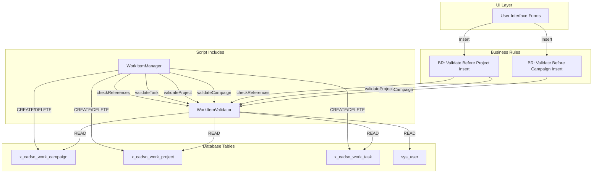

# Work Item Validation System

**Version:** 1.0.0
**Last Updated:** 2026-01-08
**Author:** ServiceNow Development Team

---

## Executive Summary

The Work Item Validation System is a comprehensive ServiceNow scripting solution that provides data validation and lifecycle management for work items including campaigns, projects, and tasks. The system demonstrates best practices for cross-script communication, including:

- **Script Include → Script Include** calling (WorkItemManager → WorkItemValidator)
- **Business Rule → Script Include** calling (BR:ValidateBefore* → WorkItemValidator)
- Consistent error handling and logging patterns
- Automatic rollback on validation failures

### Key Components

| Component | Type | Purpose |
|-----------|------|---------|
| WorkItemValidator | Script Include | Validates work item data integrity |
| WorkItemManager | Script Include | Manages work item lifecycle |
| Validate Before Campaign Insert | Business Rule | Pre-insert campaign validation |
| Validate Before Project Insert | Business Rule | Pre-insert project validation |

---

## Existing System Analysis

### sn-tools Dependency Analysis

#### Table Dependencies - x_cadso_work_campaign

```json
// Tool: trace_table_dependencies
// Parameters: {"table_name": "x_cadso_work_campaign"}
{
  "success": true,
  "data": {
    "table": "x_cadso_work_campaign",
    "scripts": ["WorkClientUtilsMS"],
    "apis": [],
    "components": [],
    "metadata": {
      "confidence": {
        "level": "HIGH",
        "score": 0.8
      }
    }
  }
}
```

#### Table Dependencies - x_cadso_work_project

```json
// Tool: trace_table_dependencies
// Parameters: {"table_name": "x_cadso_work_project"}
{
  "success": true,
  "data": {
    "table": "x_cadso_work_project",
    "scripts": ["UICalendarApiMS"],
    "apis": [],
    "components": [],
    "metadata": {
      "confidence": {
        "level": "HIGH",
        "score": 0.8
      }
    }
  }
}
```

#### WorkClientUtilsMS Full Lineage

```json
// Tool: trace_full_lineage
// Parameters: {"entity_name": "WorkClientUtilsMS", "entity_type": "script"}
{
  "success": true,
  "data": {
    "entity": "WorkClientUtilsMS",
    "entityType": "script",
    "forward": {
      "tables": [
        "x_cadso_work_project_template",
        "x_cadso_work_user_segment_m2m",
        "x_cadso_work_campaign",
        "x_cadso_work_group_to_group_m2m",
        "x_cadso_work_group_sys_user_m2m",
        "sys_user_grmember",
        "sys_user_has_role"
      ],
      "crud": [
        {"table": "x_cadso_work_campaign", "operations": ["read", "write"]}
      ]
    },
    "backward": {
      "apis": [],
      "components": []
    }
  }
}
```

---

## Architecture Overview

### Lineage Diagram



### Text-Based Dependency Flow

```
User Interface
    │
    ├── [Before Insert] ─────────────────────────────────────────────────┐
    │                                                                     │
    ▼                                                                     ▼
BR: Validate Before Campaign Insert              BR: Validate Before Project Insert
    │                                                │
    │ new WorkItemValidator()                        │ new WorkItemValidator()
    │ validateCampaign() [inline]                    │ checkReferences(campaign)
    │                                                │ validateProject() [inline]
    ▼                                                ▼
x_cadso_work_campaign (READ)                    x_cadso_work_campaign (READ)
                                                x_cadso_work_project (READ)
                                                sys_user (READ)

─────────────────────────────────────────────────────────────────────────────

WorkItemManager (Script Include)
    │
    ├── this.validator = new WorkItemValidator()    ← Script Include → Script Include
    │
    ├── createCampaign(data)
    │       ├── Pre-validation (inline)
    │       ├── INSERT → x_cadso_work_campaign
    │       ├── validator.validateCampaign(sysId)
    │       └── [On Fail] DELETE → x_cadso_work_campaign (rollback)
    │
    ├── createProject(campaignSysId, data)
    │       ├── validator.checkReferences(campaign)
    │       ├── Pre-validation (inline)
    │       ├── INSERT → x_cadso_work_project
    │       ├── validator.validateProject(sysId)
    │       └── [On Fail] DELETE → x_cadso_work_project (rollback)
    │
    └── createTask(projectSysId, data)
            ├── validator.checkReferences(project)
            ├── validator.checkReferences(user) [if assigned]
            ├── Pre-validation (inline)
            ├── INSERT → x_cadso_work_task
            ├── validator.validateTask(sysId)
            └── [On Fail] DELETE → x_cadso_work_task (rollback)
```

---

## CRUD Operations

### WorkItemValidator CRUD Matrix

| Table | CREATE | READ | UPDATE | DELETE |
|-------|:------:|:----:|:------:|:------:|
| x_cadso_work_campaign | - | X | - | - |
| x_cadso_work_project | - | X | - | - |
| x_cadso_work_task | - | X | - | - |
| sys_user | - | X | - | - |

### WorkItemManager CRUD Matrix

| Table | CREATE | READ | UPDATE | DELETE |
|-------|:------:|:----:|:------:|:------:|
| x_cadso_work_campaign | X | X | - | X (rollback) |
| x_cadso_work_project | X | X | - | X (rollback) |
| x_cadso_work_task | X | X | - | X (rollback) |
| sys_user | - | X | - | - |

### Business Rule CRUD Matrix

| Business Rule | Table | CREATE | READ | UPDATE | DELETE |
|--------------|-------|:------:|:----:|:------:|:------:|
| Validate Before Campaign Insert | x_cadso_work_campaign | - | X | - | - |
| Validate Before Project Insert | x_cadso_work_project | - | X | - | - |
| Validate Before Project Insert | x_cadso_work_campaign | - | X | - | - |
| Validate Before Project Insert | sys_user | - | X | - | - |

---

## Component Details

### 1. WorkItemValidator (Script Include)

**File:** `script-includes/WorkItemValidator.js`

#### Purpose
Validates work items ensuring data integrity before and after database operations.

#### Public Methods

| Method | Parameters | Returns | Description |
|--------|------------|---------|-------------|
| `validateCampaign` | `campaignSysId: string` | `{valid, errors, warnings}` | Validates campaign data |
| `validateProject` | `projectSysId: string` | `{valid, errors, warnings}` | Validates project data |
| `validateTask` | `taskSysId: string` | `{valid, errors, warnings}` | Validates task data |
| `checkReferences` | `tableName: string, sysId: string` | `{valid, errors, warnings}` | Validates reference integrity |

#### Validation Rules

**Campaign Validation:**
- Name is required
- State is required
- Start date must be before end date
- Budget cannot be negative
- Warning: Duplicate campaign names

**Project Validation:**
- Name is required
- State is required
- Campaign reference is required and must exist
- Priority must be 1-5 (if specified)
- Start date must be before end date

**Task Validation:**
- Short description is required
- State is required
- Project reference is required and must exist
- Assigned user must exist (if specified)
- Warning: Past due dates, long work notes

#### Usage Example

```javascript
// Direct usage
var validator = new WorkItemValidator();
var result = validator.validateCampaign('sys_id_here');

if (!result.valid) {
    gs.error('Validation failed: ' + result.errors.join(', '));
}

// Check references
var refCheck = validator.checkReferences('x_cadso_work_campaign', campaignSysId);
if (!refCheck.valid) {
    // Handle invalid reference
}
```

---

### 2. WorkItemManager (Script Include)

**File:** `script-includes/WorkItemManager.js`

#### Purpose
Manages work item lifecycle with integrated validation using WorkItemValidator.

#### Cross-Script Communication

```javascript
// WorkItemManager instantiates WorkItemValidator in constructor
initialize: function() {
    this.validator = new WorkItemValidator();  // Script Include → Script Include
}
```

#### Public Methods

| Method | Parameters | Returns | Description |
|--------|------------|---------|-------------|
| `createCampaign` | `data: Object` | `{success, sysId, errors}` | Creates validated campaign |
| `createProject` | `campaignSysId: string, data: Object` | `{success, sysId, errors}` | Creates validated project |
| `createTask` | `projectSysId: string, data: Object` | `{success, sysId, errors}` | Creates validated task |

#### Rollback Pattern

```javascript
// Pattern used in all create methods
var sysId = gr.insert();  // Create record

var validationResult = this.validator.validateCampaign(sysId);

if (!validationResult.valid) {
    // Rollback - delete the created record
    gr = new GlideRecord(tableName);
    if (gr.get(sysId)) {
        gr.deleteRecord();
    }
    // Return error
}
```

#### Usage Example

```javascript
var manager = new WorkItemManager();

// Create campaign
var campaignResult = manager.createCampaign({
    name: 'Q1 Marketing Campaign',
    description: 'Marketing initiatives for Q1',
    state: 'active',
    start_date: '2024-01-01',
    end_date: '2024-03-31',
    budget: 50000
});

if (campaignResult.success) {
    // Create project under campaign
    var projectResult = manager.createProject(campaignResult.sysId, {
        name: 'Website Redesign',
        state: 'active',
        priority: 1
    });

    if (projectResult.success) {
        // Create task under project
        var taskResult = manager.createTask(projectResult.sysId, {
            short_description: 'Design mockups',
            state: 'open',
            assigned_to: 'user_sys_id',
            due_date: '2024-01-15'
        });
    }
}
```

---

### 3. Business Rules

#### Validate Before Campaign Insert

**File:** `business-rules/validate_before_campaign_insert.js`

| Property | Value |
|----------|-------|
| Table | x_cadso_work_campaign |
| When | Before |
| Insert | true |
| Update | false |
| Delete | false |
| Order | 100 |

**Cross-Script Communication:**
```javascript
// Business Rule → Script Include
var validator = new WorkItemValidator();
// Note: Cannot use validator.validateCampaign() because sys_id doesn't exist yet
// Uses inline validation with access to WorkItemValidator patterns
```

#### Validate Before Project Insert

**File:** `business-rules/validate_before_project_insert.js`

| Property | Value |
|----------|-------|
| Table | x_cadso_work_project |
| When | Before |
| Insert | true |
| Update | false |
| Delete | false |
| Order | 100 |

**Cross-Script Communication:**
```javascript
// Business Rule → Script Include
var validator = new WorkItemValidator();
var campaignRefResult = validator.checkReferences('x_cadso_work_campaign', campaignSysId);
var managerRefResult = validator.checkReferences('sys_user', manager);
```

---

## Security Analysis

### Access Control

| Component | Client Callable | Role Requirements | ACL Impact |
|-----------|:--------------:|-------------------|------------|
| WorkItemValidator | No | None (server-side) | Bypasses ACLs |
| WorkItemManager | No | None (server-side) | Bypasses ACLs |
| Business Rules | N/A | N/A | Runs as system |

### Security Considerations

1. **No Role Checks Built-in**
   - Scripts run with system privileges
   - Calling code must implement role validation
   - Consider adding role checks for sensitive operations

2. **Error Message Exposure**
   - Validation errors may expose sys_id values
   - Consider sanitizing error messages for end users

3. **SQL Injection Protection**
   - All database access uses GlideRecord (safe)
   - No raw SQL queries

4. **Input Validation**
   - All methods validate input parameters
   - Type checking on data objects
   - Null/empty string handling

### Recommended Security Enhancements

```javascript
// Add role check before operations
if (!gs.hasRole('work_admin')) {
    result.errors.push('Insufficient permissions');
    return result;
}
```

---

## Performance Analysis

### Query Overhead by Operation

| Operation | Query Count | Estimated Time |
|-----------|:-----------:|----------------|
| validateCampaign | 2-3 | 50-100ms |
| validateProject | 3-4 | 75-150ms |
| validateTask | 4-5 | 100-200ms |
| checkReferences | 1-2 | 25-50ms |
| createCampaign | 4-6 | 150-300ms |
| createProject | 5-7 | 200-350ms |
| createTask | 6-8 | 250-400ms |

### Performance Considerations

1. **Synchronous Validation**
   - All validation is synchronous
   - May impact high-volume operations (>1000 records/minute)

2. **Business Rule Impact**
   - Before Insert rules add latency to every insert
   - Cannot be bypassed by users

3. **Logging Overhead**
   - All operations logged (INFO, WARN, ERROR)
   - Consider log level adjustment in high-volume environments

4. **Rollback Cost**
   - Failed validation requires DELETE operation
   - Two transactions per failed create

### Optimization Opportunities

```javascript
// Batch validation for bulk operations
function validateBatch(items) {
    // Pre-fetch all reference data
    // Validate in memory
    // Reduce query count
}
```

---

## Testing Strategy

### Unit Tests

**File:** `tests/test_work_item_validator.js`

| Test Category | Test Count | Coverage |
|---------------|:----------:|----------|
| validateCampaign | 5 | Valid, missing fields, not found, dates, budget |
| validateProject | 3 | Valid, no campaign, invalid priority |
| validateTask | 3 | Valid, no project, no description |
| checkReferences | 4 | Valid, missing table, invalid table, not found |

**File:** `tests/test_work_item_manager.js`

| Test Category | Test Count | Coverage |
|---------------|:----------:|----------|
| createCampaign | 3 | Valid, missing fields, invalid data |
| createProject | 3 | Valid, no campaign, invalid campaign |
| createTask | 3 | Valid, no project, invalid user |
| Integration | 3 | Cross-script, rollback, full hierarchy |

### Running Tests

```bash
# Run all tests
cd /home/coltrip/claude-automation
node tests/test_work_item_validator.js
node tests/test_work_item_manager.js
```

### Integration Tests

1. **Cross-Script Communication Test**
   - Verify WorkItemManager correctly calls WorkItemValidator
   - Validate error propagation between scripts

2. **Business Rule Integration Test**
   - Insert invalid campaign - verify abort
   - Insert valid campaign - verify success
   - Insert project with invalid campaign reference - verify abort

3. **End-to-End Test**
   - Create campaign via form
   - Create project via form
   - Create task via form
   - Verify all validation rules applied

---

## Implementation Plan

### Deployment Sequence

```
1. WorkItemValidator (Script Include)
   └── No dependencies

2. WorkItemManager (Script Include)
   └── Depends on: WorkItemValidator

3. Validate Before Campaign Insert (Business Rule)
   └── Depends on: WorkItemValidator

4. Validate Before Project Insert (Business Rule)
   └── Depends on: WorkItemValidator
```

### Step-by-Step Deployment

1. **Deploy WorkItemValidator**
   - Upload script-includes/WorkItemValidator.js
   - Set Active = true
   - Test: `new WorkItemValidator().checkReferences('incident', '...')`

2. **Deploy WorkItemManager**
   - Upload script-includes/WorkItemManager.js
   - Set Active = true
   - Test: `new WorkItemManager().createCampaign({name:'Test', state:'active'})`

3. **Deploy Business Rules**
   - Upload business-rules/validate_before_campaign_insert.js
   - Upload business-rules/validate_before_project_insert.js
   - Set Active = true
   - Test: Create campaign/project via form

---

## Effort Estimation

| Task | Effort | Cost Estimate |
|------|:------:|---------------|
| WorkItemValidator development | 8 hours | $800 |
| WorkItemManager development | 8 hours | $800 |
| Business Rules development | 4 hours | $400 |
| Unit test development | 6 hours | $600 |
| Integration testing | 4 hours | $400 |
| Documentation | 3 hours | $300 |
| Code review | 2 hours | $200 |
| Deployment | 1 hour | $100 |
| **Total** | **36 hours** | **$3,600** |

---

## Risk Assessment

### Potential Issues & Constraints

#### Technical Constraints

| Risk | Likelihood | Impact | Mitigation |
|------|:----------:|:------:|------------|
| GlideDBObjectManager may not detect all custom tables | Medium | Low | Use GlideRecord.isValid() as fallback |
| Rollback pattern creates 2 transactions | Low | Medium | Accept for data integrity |
| Synchronous validation adds latency | High | Medium | Batch operations for bulk imports |
| WorkItemValidator dependency for WorkItemManager | Low | High | Deploy WorkItemValidator first |

#### Business Constraints

| Risk | Likelihood | Impact | Mitigation |
|------|:----------:|:------:|------------|
| Strict validation may block valid business operations | Medium | High | Review validation rules with stakeholders |
| High-volume inserts may bottleneck | Low | Medium | Add batch operation support |
| Log growth in high-volume environments | Medium | Low | Implement log rotation policy |

#### Data Integrity Constraints

| Risk | Likelihood | Impact | Mitigation |
|------|:----------:|:------:|------------|
| Orphaned records if rollback fails | Low | High | Add cleanup job for orphaned records |
| Race condition during validation | Low | Medium | Use GlideRecord setWorkflow(false) |
| Reference to deleted parent | Medium | High | Add cascade delete consideration |

#### Security Constraints

| Risk | Likelihood | Impact | Mitigation |
|------|:----------:|:------:|------------|
| Scripts bypass ACLs | High | Medium | Document and add role checks |
| Error messages expose sys_ids | Medium | Low | Sanitize messages for end users |
| No audit trail for validation failures | Medium | Medium | Add audit logging |

---

## Deployment & Rollback

### Deployment Steps

1. **Pre-Deployment Checklist**
   - [ ] All unit tests passing
   - [ ] Code review completed
   - [ ] Documentation updated
   - [ ] Backup of existing scripts

2. **Deployment Sequence**
   ```bash
   # 1. Deploy Script Includes
   ServiceNow Studio > Script Includes > Import WorkItemValidator.js
   ServiceNow Studio > Script Includes > Import WorkItemManager.js

   # 2. Deploy Business Rules
   ServiceNow Studio > Business Rules > Import validate_before_campaign_insert.js
   ServiceNow Studio > Business Rules > Import validate_before_project_insert.js

   # 3. Activate
   Set Active = true for all components
   ```

3. **Post-Deployment Verification**
   - [ ] Test campaign creation via UI
   - [ ] Test project creation via UI
   - [ ] Test validation error messages
   - [ ] Verify logging working

### Rollback Procedure

If issues arise after deployment:

1. **Immediate Rollback (< 5 minutes)**
   ```
   1. Navigate to Business Rules
   2. Set Active = false for:
      - Validate Before Campaign Insert
      - Validate Before Project Insert
   3. Navigate to Script Includes
   4. Set Active = false for:
      - WorkItemManager
      - WorkItemValidator
   ```

2. **Full Rollback (if needed)**
   ```
   1. Restore Script Includes from backup
   2. Restore Business Rules from backup
   3. Clear server cache
   4. Test basic functionality
   ```

3. **Rollback Verification**
   - [ ] Campaign creation works without validation
   - [ ] Project creation works without validation
   - [ ] No error messages in system logs

---

## Appendix

### A. File Locations

```
/home/coltrip/claude-automation/
├── script-includes/
│   ├── WorkItemValidator.js
│   └── WorkItemManager.js
├── business-rules/
│   ├── validate_before_campaign_insert.js
│   └── validate_before_project_insert.js
├── tests/
│   ├── test_work_item_validator.js
│   └── test_work_item_manager.js
└── docs/
    └── WORK_ITEM_VALIDATION_SYSTEM.md
```

### B. Return Object Formats

**Validation Result:**
```javascript
{
    valid: boolean,      // true if validation passed
    errors: string[],    // Array of error messages
    warnings: string[]   // Array of warning messages
}
```

**Create Result:**
```javascript
{
    success: boolean,    // true if creation succeeded
    sysId: string,       // sys_id of created record (empty on failure)
    errors: string[]     // Array of error messages
}
```

### C. Logging Format

```
[WorkItemValidator] validateCampaign: Campaign abc123 validation passed - Errors: 0, Warnings: 1
[WorkItemManager] createCampaign: Successfully created campaign abc123
[BR: Validate Before Campaign Insert] Campaign validation passed for: Test Campaign
```

---

*Document generated with sn-tools analysis*
