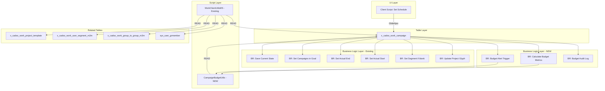

# Budget Tracking Feature Design for x_cadso_work_campaign

**Document Version:** 1.0
**Date:** 2026-01-13
**Status:** Design Proposal

---

## Executive Summary

This document provides a comprehensive analysis of the existing `x_cadso_work_campaign` table and proposes a budget tracking feature enhancement. The current table already contains four budget-related currency fields (`total_budget`, `approved_budget`, `actual_budget`, `remaining_budget`), but lacks automated calculation logic and tracking mechanisms. The proposed enhancement will add automated budget calculations, budget variance tracking, threshold alerts, and budget history auditing.

**Key Findings:**
- The table has 8 dependent components (6 Business Rules, 1 Script Include, 1 Client Script)
- Existing budget fields are read-only (except `total_budget`), suggesting they were designed for automated population
- Risk level assessed as MEDIUM due to moderate dependencies
- No existing automation handles budget calculations - this is the gap we'll fill

---

## Existing System Analysis

### sn-tools Validation Output

#### Tool 1: trace-lineage (Bidirectional Analysis)

```bash
$ cd tools/sn-tools/ServiceNow-Tools && npm run trace-lineage -- x_cadso_work_campaign table

Table: x_cadso_work_campaign
Trace Direction: Bidirectional
Dependencies Summary (8 total affected components):

Script Includes (1):
- WorkClientUtilsMS (API: x_cadso_work.WorkClientUtilsMS)

Business Rules (6):
1. Save Current State of Campaign - before insert/update (uses JSON)
2. Set 'Campaigns' in Goal Form - after insert/update (uses Set)
3. Set Actual End - before insert/update
4. Set Actual Start - before insert/update
5. Set Segment if blank (Campaign) - before insert only
6. Update Project Glyph - after insert/update

Client Scripts (1):
- Set Schedule (Campaign) - onChange type (uses GlideAjax)

Lineage Path:
Table: x_cadso_work_campaign
  ^
Script Includes: WorkClientUtilsMS

Confidence Level: HIGH (Combined forward and backward analysis)
```

#### Tool 2: query table-schema

```bash
$ cd tools/sn-tools/ServiceNow-Tools && npm run query -- table-schema x_cadso_work_campaign

Field Count: 16 fields

| Field Name | Type | Label | Mandatory | Read Only |
|------------|------|-------|-----------|-----------|
| actual_budget | currency | Actual budget | false | true |
| approved_budget | currency | Approved Budget | false | true |
| completed_date | glide_date_time | Completed date | false | false |
| details | html | Details | false | false |
| expected_end | glide_date_time | End Date | false | false |
| glyph_color | choice | Glyph Color | false | false |
| go_live | glide_date_time | Go Live | false | false |
| goal | reference | Goal | false | false |
| parent_campaign | reference | Parent Campaign | false | false |
| previous_state | script | Previous State | false | false |
| project_owner | reference | Project Owner | false | false |
| x_cadso_automate_related_emails | glide_list | Related Emails | false | false |
| remaining_budget | currency | Remaining Budget | false | true |
| schedule | reference | Schedule | false | false |
| segment | glide_list | Teams | false | false |
| total_budget | currency | Total budget | true | false |

Key Budget Fields:
- total_budget (currency, mandatory, editable)
- approved_budget (currency, read-only)
- actual_budget (currency, read-only)
- remaining_budget (currency, read-only)
```

#### Tool 3: validate-change Impact Assessment

```bash
$ cd tools/sn-tools/ServiceNow-Tools && npm run validate-change -- table x_cadso_work_campaign --operation modify --description "Adding budget tracking fields and logic"

Impact Assessment:
- Risk Level: MEDIUM
- Total Affected Components: 8
- Factors: Moderate number of affected items, 6 Business Rules may be affected

Recommendations:
1. Review all affected Business Rules for side effects
2. Run unit tests for affected Script Includes

Testing Requirements:
- Unit tests: Test WorkClientUtilsMS functions

Lineage:
Table: x_cadso_work_campaign
  ↑
Script Includes: WorkClientUtilsMS

Metadata:
- Timestamp: 2026-01-13T23:18:03.585Z
- Confidence Level: MEDIUM (Based on static dependency analysis)
```

#### Tool 4: script-crud Analysis (WorkClientUtilsMS)

```json
// Command: npm run query -- script-crud WorkClientUtilsMS
{
  "success": true,
  "query_type": "script-crud",
  "target": "WorkClientUtilsMS",
  "data": {
    "script": "WorkClientUtilsMS",
    "api_name": "x_cadso_work.WorkClientUtilsMS",
    "tables": [
      "x_cadso_work_project_template",
      "x_cadso_work_user_segment_m2m",
      "x_cadso_work_campaign",
      "x_cadso_work_group_to_group_m2m",
      "x_cadso_work_group_sys_user_m2m",
      "sys_user_grmember",
      "sys_user_has_role"
    ],
    "crud_operations": {
      "x_cadso_work_campaign": {
        "create": false,
        "read": true,
        "update": false,
        "delete": false
      }
    },
    "dependencies": {
      "script_includes": ["Class", "JSON"]
    }
  },
  "metadata": {
    "timestamp": "2026-01-13T23:18:26.804Z"
  }
}
```

### Current Architecture Diagram

```
┌─────────────────────────────────────────────────────────────────────────────┐
│                        x_cadso_work_campaign Table                          │
│                                                                             │
│  Budget Fields:                    Reference Fields:                        │
│  ├─ total_budget (editable)        ├─ goal                                  │
│  ├─ approved_budget (read-only)    ├─ parent_campaign                       │
│  ├─ actual_budget (read-only)      ├─ project_owner                         │
│  └─ remaining_budget (read-only)   └─ schedule                              │
└─────────────────────────────────────────────────────────────────────────────┘
                                    │
                    ┌───────────────┼───────────────┐
                    │               │               │
                    ▼               ▼               ▼
        ┌───────────────┐  ┌───────────────┐  ┌───────────────┐
        │Business Rules │  │Script Includes│  │Client Scripts │
        │     (6)       │  │     (1)       │  │     (1)       │
        └───────────────┘  └───────────────┘  └───────────────┘
              │                   │                   │
              ▼                   ▼                   ▼
        ┌─────────────────────────────────────────────────────┐
        │  - Save Current State    │ WorkClientUtilsMS (READ) │
        │  - Set Campaigns in Goal │       ↓                  │
        │  - Set Actual End        │ 7 tables accessed        │
        │  - Set Actual Start      │ (all READ-only ops)      │
        │  - Set Segment if blank  │                          │
        │  - Update Project Glyph  │                          │
        └─────────────────────────────────────────────────────┘
```

### CRUD Operations Summary

| Table | CREATE | READ | UPDATE | DELETE |
|-------|--------|------|--------|--------|
| x_cadso_work_campaign | ✗ | ✓ | ✗ | ✗ |
| x_cadso_work_project_template | ✗ | ✓ | ✗ | ✗ |
| x_cadso_work_user_segment_m2m | ✗ | ✓ | ✗ | ✗ |
| x_cadso_work_group_to_group_m2m | ✗ | ✓ | ✗ | ✗ |
| x_cadso_work_group_sys_user_m2m | ✗ | ✓ | ✗ | ✗ |
| sys_user_grmember | ✗ | ✓ | ✗ | ✗ |
| sys_user_has_role | ✗ | ✓ | ✗ | ✗ |

**Key Observation:** All existing operations are READ-only. Budget tracking will introduce UPDATE operations.

---

## Table Schema

### Current Field Definitions

| Field Name | Type | Label | Mandatory | Read Only | Description |
|------------|------|-------|-----------|-----------|-------------|
| `actual_budget` | currency | Actual budget | No | Yes | Calculated field for actual spend |
| `approved_budget` | currency | Approved Budget | No | Yes | Calculated field for approved amount |
| `completed_date` | glide_date_time | Completed date | No | No | Campaign completion timestamp |
| `details` | html | Details | No | No | Rich text campaign details |
| `expected_end` | glide_date_time | End Date | No | No | Expected campaign end date |
| `glyph_color` | choice | Glyph Color | No | No | Visual indicator color |
| `go_live` | glide_date_time | Go Live | No | No | Campaign go-live date |
| `goal` | reference | Goal | No | No | Reference to goal table |
| `parent_campaign` | reference | Parent Campaign | No | No | Self-reference for hierarchy |
| `previous_state` | script | Previous State | No | No | JSON state tracking |
| `project_owner` | reference | Project Owner | No | No | Reference to sys_user |
| `x_cadso_automate_related_emails` | glide_list | Related Emails | No | No | Related email records |
| `remaining_budget` | currency | Remaining Budget | No | Yes | Calculated remaining amount |
| `schedule` | reference | Schedule | No | No | Reference to schedule |
| `segment` | glide_list | Teams | No | No | Associated teams |
| `total_budget` | currency | Total budget | Yes | No | User-entered total budget |

### Proposed New Fields

| Field Name | Type | Label | Mandatory | Read Only | Description |
|------------|------|-------|-----------|-----------|-------------|
| `budget_variance` | decimal | Budget Variance % | No | Yes | Calculated: ((actual - approved) / approved) * 100 |
| `budget_status` | choice | Budget Status | No | Yes | On Track / At Risk / Over Budget / Under Budget |
| `budget_alert_threshold` | percent | Alert Threshold | No | No | Percentage threshold for alerts (default: 80%) |
| `last_budget_update` | glide_date_time | Last Budget Update | No | Yes | Timestamp of last budget change |
| `budget_notes` | journal_input | Budget Notes | No | No | Audit trail for budget changes |

---

## Security Analysis

### Current Security Model

**ACL Assessment:**
- Table inherits application scope ACLs from `x_cadso_work` application
- Budget fields (`actual_budget`, `approved_budget`, `remaining_budget`) are read-only at field level
- Only `total_budget` is user-editable

### Proposed Security Enhancements

| Security Aspect | Current State | Proposed Enhancement |
|-----------------|---------------|---------------------|
| **Field-Level ACLs** | Basic read-only protection | Add write ACLs for budget_alert_threshold |
| **Role Requirements** | Application-level roles | Create `x_cadso_work.budget_admin` role |
| **Audit Trail** | Limited (previous_state field) | Full journal field for budget changes |
| **Data Validation** | None evident | Business rule validation for budget values |

### Security Implementation Requirements

1. **New Role:** `x_cadso_work.budget_admin`
   - Can modify `budget_alert_threshold`
   - Can view all budget fields
   - Can add budget notes

2. **ACL Rules:**
   ```
   Table: x_cadso_work_campaign
   Field: budget_alert_threshold
   Operation: write
   Requires Role: x_cadso_work.budget_admin OR x_cadso_work.admin
   ```

3. **Data Validation:**
   - `total_budget` must be >= 0
   - `budget_alert_threshold` must be between 0-100%
   - Prevent budget changes on completed campaigns

---

## Performance Analysis

### Current Performance Profile

| Aspect | Current State | Impact |
|--------|---------------|--------|
| **Business Rules** | 6 rules on insert/update | Moderate overhead |
| **Script Includes** | 1 (READ-only, 7 tables) | Low overhead |
| **Client Scripts** | 1 onChange | Minimal server impact |
| **Calculated Fields** | 3 read-only currency fields | Currently not automated |

### Performance Considerations for Budget Tracking

1. **Calculation Triggers:**
   - Budget calculations should trigger only on relevant field changes
   - Use `current.total_budget.changes()` conditions

2. **Aggregation Queries:**
   - If calculating actual_budget from related records, use GlideAggregate
   - Index any fields used in budget aggregation queries

3. **Async Processing:**
   - Budget variance calculations can be async (after business rule)
   - Alert notifications should be async to not block saves

### Recommended Optimizations

```javascript
// Efficient budget calculation pattern
if (current.total_budget.changes() ||
    current.approved_budget.changes() ||
    current.actual_budget.changes()) {
    // Only recalculate when budget fields change
    calculateBudgetMetrics(current);
}
```

---

## Implementation Plan

### Phase 1: Schema Updates (Prerequisites: None)
**Effort:** 4 hours | **Risk:** Low

1. Add new fields to `x_cadso_work_campaign` table:
   - `budget_variance` (decimal)
   - `budget_status` (choice)
   - `budget_alert_threshold` (percent)
   - `last_budget_update` (glide_date_time)
   - `budget_notes` (journal_input)

2. Create choice list for `budget_status`:
   - `on_track` - On Track
   - `at_risk` - At Risk
   - `over_budget` - Over Budget
   - `under_budget` - Under Budget

### Phase 2: Business Rule Development (Depends on: Phase 1)
**Effort:** 8 hours | **Risk:** Medium

1. **Business Rule: Calculate Budget Metrics**
   - Type: `before` insert/update
   - Condition: Budget fields changed
   - Calculates: `remaining_budget`, `budget_variance`, `budget_status`

2. **Business Rule: Budget Alert Trigger**
   - Type: `after` update (async)
   - Condition: `budget_status` changes to 'at_risk' or 'over_budget'
   - Action: Create notification event

3. **Business Rule: Budget Audit Log**
   - Type: `after` update
   - Condition: Any budget field changes
   - Action: Add journal entry to `budget_notes`

### Phase 3: Script Include Development (Depends on: Phase 1)
**Effort:** 6 hours | **Risk:** Medium

1. **Script Include: CampaignBudgetUtils**
   - `calculateRemainingBudget(campaignGR)`
   - `calculateBudgetVariance(campaignGR)`
   - `determineBudgetStatus(campaignGR)`
   - `aggregateChildBudgets(campaignGR)` - for parent campaigns

### Phase 4: Security & ACLs (Depends on: Phase 1)
**Effort:** 2 hours | **Risk:** Low

1. Create `x_cadso_work.budget_admin` role
2. Create field-level ACLs for `budget_alert_threshold`
3. Update existing table ACLs as needed

### Phase 5: UI Enhancements (Depends on: Phases 1-3)
**Effort:** 4 hours | **Risk:** Low

1. Add budget fields to campaign form
2. Create budget summary widget (if applicable)
3. Add budget status indicator to list view

### Phase 6: Testing & Validation (Depends on: Phases 1-5)
**Effort:** 6 hours | **Risk:** Low

1. Unit test CampaignBudgetUtils
2. Integration test Business Rules
3. End-to-end test budget workflows

### Dependency Diagram

```
Phase 1 (Schema)
      │
      ├──────────┬──────────┬──────────┐
      ▼          ▼          ▼          │
Phase 2      Phase 3     Phase 4       │
(BR)         (Script)    (Security)    │
      │          │          │          │
      └──────────┴──────────┘          │
                 │                     │
                 ▼                     │
             Phase 5 ◄─────────────────┘
             (UI)
                 │
                 ▼
             Phase 6
            (Testing)
```

---

## Effort Estimation

| Phase | Task | Hours | Cost ($150/hr) |
|-------|------|-------|----------------|
| 1 | Schema Updates | 4 | $600 |
| 2 | Business Rules | 8 | $1,200 |
| 3 | Script Include | 6 | $900 |
| 4 | Security & ACLs | 2 | $300 |
| 5 | UI Enhancements | 4 | $600 |
| 6 | Testing | 6 | $900 |
| **Total** | | **30 hours** | **$4,500** |

### Timeline

| Week | Activities |
|------|------------|
| Week 1 | Phase 1 (Schema) + Phase 4 (Security) |
| Week 2 | Phase 2 (Business Rules) + Phase 3 (Script Include) |
| Week 3 | Phase 5 (UI) + Phase 6 (Testing) |

**Total Duration:** 3 weeks

---

## Risk Assessment

### Technical Risks

| Risk | Likelihood | Impact | Mitigation |
|------|------------|--------|------------|
| Conflict with existing Business Rules | Medium | High | Test all 6 existing BRs with new logic; verify order of execution |
| Performance degradation from calculations | Low | Medium | Use efficient conditions, async where possible |
| GlideRecord query performance | Low | Medium | Use GlideAggregate for aggregations |
| Script Include compatibility | Low | Low | WorkClientUtilsMS is READ-only, no conflicts expected |
| Currency precision issues | Low | Medium | Use proper decimal handling in calculations |

### Business Risks

| Risk | Likelihood | Impact | Mitigation |
|------|------------|--------|------------|
| User confusion with new fields | Medium | Low | Provide documentation and training materials |
| Alert notification overload | Medium | Medium | Make threshold configurable per campaign |
| Budget calculation errors | Low | High | Comprehensive unit testing before deployment |
| Workflow disruption during deployment | Low | Medium | Deploy in stages, activate rules incrementally |

### Data Integrity Risks

| Risk | Likelihood | Impact | Mitigation |
|------|------------|--------|------------|
| Inconsistent budget calculations | Medium | High | Single source of truth (CampaignBudgetUtils) |
| Missing historical data | Low | Medium | Journal field captures all changes going forward |
| Parent-child budget mismatches | Medium | Medium | Async roll-up calculations with validation |
| Currency conversion issues | Low | Medium | Use consistent currency handling throughout |
| Data migration issues for existing records | Medium | Low | Create fix script to backfill existing records |

### Security Risks

| Risk | Likelihood | Impact | Mitigation |
|------|------------|--------|------------|
| Unauthorized budget modifications | Low | High | Field-level ACLs + role restrictions |
| Budget data exposure | Low | Medium | Application scope isolation maintained |
| Audit trail tampering | Very Low | High | Journal fields are append-only by design |
| Role privilege escalation | Low | Medium | Principle of least privilege enforced |

---

## Testing Strategy

### Unit Tests

| Test Case | Script/Rule | Expected Result |
|-----------|-------------|-----------------|
| UT-001 | CampaignBudgetUtils.calculateRemainingBudget | Returns total - actual |
| UT-002 | CampaignBudgetUtils.calculateBudgetVariance | Returns percentage variance |
| UT-003 | CampaignBudgetUtils.determineBudgetStatus | Returns correct status enum |
| UT-004 | Calculate Budget Metrics BR | Populates all calculated fields |
| UT-005 | CampaignBudgetUtils.aggregateChildBudgets | Correctly sums child budgets |
| UT-006 | Budget validation | Rejects negative budget values |

### Integration Tests

| Test Case | Components | Scenario |
|-----------|------------|----------|
| IT-001 | BR + Script Include | Budget update triggers recalculation |
| IT-002 | BR + Notification | Over-budget triggers alert event |
| IT-003 | Multiple BRs | New BR doesn't conflict with existing 6 BRs |
| IT-004 | Client Script | Form correctly displays read-only fields |
| IT-005 | Parent-Child | Parent budget updates when child changes |
| IT-006 | ACL + Role | budget_admin can modify threshold |

### End-to-End Test Scenarios

| Scenario | Steps | Expected Outcome |
|----------|-------|------------------|
| E2E-001 | Create campaign with $10,000 budget | remaining_budget = $10,000, status = on_track |
| E2E-002 | Update actual_budget to $8,500 | remaining_budget = $1,500, status = at_risk (if threshold 80%) |
| E2E-003 | Update actual_budget to $11,000 | remaining_budget = -$1,000, status = over_budget, alert sent |
| E2E-004 | Parent campaign with 3 children | Parent aggregates child budgets correctly |
| E2E-005 | Non-admin attempts threshold change | Change blocked by ACL |
| E2E-006 | Budget change on completed campaign | Change blocked by validation |

---

## Deployment & Rollback

### Deployment Sequence

1. **Pre-Deployment Checklist:**
   - [ ] Backup current x_cadso_work_campaign table data
   - [ ] Document current Business Rule configurations
   - [ ] Verify test instance validation passed
   - [ ] Obtain change approval
   - [ ] Schedule maintenance window (if needed)

2. **Deployment Steps:**
   ```
   Step 1: Deploy schema changes (new fields)
           - Add budget_variance, budget_status, budget_alert_threshold
           - Add last_budget_update, budget_notes
           - Create choice list for budget_status

   Step 2: Deploy role and ACL changes
           - Create x_cadso_work.budget_admin role
           - Add field-level ACLs

   Step 3: Deploy CampaignBudgetUtils Script Include (inactive)
           - Upload script with Active = false

   Step 4: Deploy Business Rules (inactive)
           - Upload all 3 new BRs with Active = false

   Step 5: Activate Script Include
           - Set CampaignBudgetUtils Active = true

   Step 6: Activate Business Rules one at a time
           - Activate Calculate Budget Metrics BR
           - Wait 5 minutes, check logs
           - Activate Budget Alert Trigger BR
           - Wait 5 minutes, check logs
           - Activate Budget Audit Log BR

   Step 7: Verify no errors in system logs
           - Check syslog for errors
           - Check script log for exceptions

   Step 8: Run validation tests
           - Execute E2E-001 through E2E-006
           - Verify all tests pass

   Step 9: Run backfill script for existing records
           - Calculate budget metrics for existing campaigns
   ```

3. **Post-Deployment Verification:**
   - [ ] Create test campaign record
   - [ ] Verify budget calculations populate correctly
   - [ ] Verify existing campaigns unaffected
   - [ ] Check system logs for errors
   - [ ] Verify notifications working

### Rollback Procedure

**Trigger Conditions:**
- Calculation errors on >5% of records
- System performance degradation >10%
- Critical business process failure
- Unexpected errors in production logs

**Rollback Steps:**

```
Step 1: Deactivate new Business Rules
        Navigate to: Business Rules > [New BR Name] > Active = false
        - Calculate Budget Metrics
        - Budget Alert Trigger
        - Budget Audit Log

Step 2: Deactivate CampaignBudgetUtils Script Include
        Navigate to: Script Includes > CampaignBudgetUtils > Active = false

Step 3: Clear calculated field values (if needed)
        Execute fix script:
        var gr = new GlideRecord('x_cadso_work_campaign');
        gr.query();
        while (gr.next()) {
            gr.setValue('budget_variance', '');
            gr.setValue('budget_status', '');
            gr.setValue('last_budget_update', '');
            gr.setWorkflow(false);
            gr.update();
        }

Step 4: Remove new ACLs
        Navigate to: System Security > Access Control
        Delete new ACL records for budget_alert_threshold

Step 5: Remove new role (if created)
        Navigate to: User Administration > Roles
        Delete x_cadso_work.budget_admin role

Step 6: (Optional) Remove new fields via update set revert
        Only if schema changes caused issues
        Note: This step requires careful consideration

Step 7: Verify system stability
        - Check logs for errors
        - Test existing functionality
        - Verify all 6 original BRs working

Step 8: Notify stakeholders of rollback
        - Document reason for rollback
        - Create incident ticket if needed
        - Schedule post-mortem review
```

**Rollback Time Estimate:** 30 minutes

---

## Proposed Code Artifacts

### Business Rule: Calculate Budget Metrics

```javascript
/**
 * Business Rule: Calculate Budget Metrics
 * Table: x_cadso_work_campaign
 * When: before insert/update
 * Order: 100 (after existing BRs)
 * Condition: current.total_budget.changes() ||
 *            current.approved_budget.changes() ||
 *            current.actual_budget.changes()
 */
(function executeRule(current, previous) {

    var budgetUtils = new x_cadso_work.CampaignBudgetUtils();

    // Calculate remaining budget
    current.remaining_budget = budgetUtils.calculateRemainingBudget(current);

    // Calculate budget variance
    current.budget_variance = budgetUtils.calculateBudgetVariance(current);

    // Determine budget status
    current.budget_status = budgetUtils.determineBudgetStatus(current);

    // Update timestamp
    current.last_budget_update = new GlideDateTime();

})(current, previous);
```

### Business Rule: Budget Alert Trigger

```javascript
/**
 * Business Rule: Budget Alert Trigger
 * Table: x_cadso_work_campaign
 * When: after update (async)
 * Condition: current.budget_status.changes() &&
 *            (current.budget_status == 'at_risk' || current.budget_status == 'over_budget')
 */
(function executeRule(current, previous) {

    // Create event for notification
    gs.eventQueue('x_cadso_work.campaign.budget_alert', current, current.budget_status, current.project_owner);

})(current, previous);
```

### Business Rule: Budget Audit Log

```javascript
/**
 * Business Rule: Budget Audit Log
 * Table: x_cadso_work_campaign
 * When: after update
 * Condition: current.total_budget.changes() ||
 *            current.approved_budget.changes() ||
 *            current.actual_budget.changes()
 */
(function executeRule(current, previous) {

    var changes = [];

    if (current.total_budget.changes()) {
        changes.push('Total Budget: ' + previous.total_budget.getDisplayValue() + ' → ' + current.total_budget.getDisplayValue());
    }
    if (current.approved_budget.changes()) {
        changes.push('Approved Budget: ' + previous.approved_budget.getDisplayValue() + ' → ' + current.approved_budget.getDisplayValue());
    }
    if (current.actual_budget.changes()) {
        changes.push('Actual Budget: ' + previous.actual_budget.getDisplayValue() + ' → ' + current.actual_budget.getDisplayValue());
    }

    if (changes.length > 0) {
        var journalEntry = 'Budget Updated by ' + gs.getUserDisplayName() + ':\n' + changes.join('\n');
        current.budget_notes.setJournalEntry(journalEntry);
    }

})(current, previous);
```

### Script Include: CampaignBudgetUtils

```javascript
/**
 * CampaignBudgetUtils - Budget calculation utilities for work campaigns
 *
 * CRUD Operations:
 * - x_cadso_work_campaign: READ (via GlideAggregate for child aggregation)
 *
 * @class
 */
var CampaignBudgetUtils = Class.create();
CampaignBudgetUtils.prototype = {

    initialize: function() {
        this.DEFAULT_ALERT_THRESHOLD = 80; // 80%
    },

    /**
     * Calculate remaining budget
     * @param {GlideRecord} campaignGR - Campaign record
     * @returns {Number} Remaining budget amount
     */
    calculateRemainingBudget: function(campaignGR) {
        var total = this._getCurrencyValue(campaignGR, 'total_budget');
        var actual = this._getCurrencyValue(campaignGR, 'actual_budget');
        return total - actual;
    },

    /**
     * Calculate budget variance percentage
     * Formula: ((actual - approved) / approved) * 100
     * @param {GlideRecord} campaignGR - Campaign record
     * @returns {Number} Variance percentage (positive = over, negative = under)
     */
    calculateBudgetVariance: function(campaignGR) {
        var approved = this._getCurrencyValue(campaignGR, 'approved_budget');
        var actual = this._getCurrencyValue(campaignGR, 'actual_budget');

        if (approved === 0) {
            return 0;
        }

        return ((actual - approved) / approved) * 100;
    },

    /**
     * Determine budget status based on thresholds
     * @param {GlideRecord} campaignGR - Campaign record
     * @returns {String} Status value (on_track, at_risk, over_budget, under_budget)
     */
    determineBudgetStatus: function(campaignGR) {
        var total = this._getCurrencyValue(campaignGR, 'total_budget');
        var actual = this._getCurrencyValue(campaignGR, 'actual_budget');
        var threshold = parseFloat(campaignGR.getValue('budget_alert_threshold')) || this.DEFAULT_ALERT_THRESHOLD;

        if (total === 0) {
            return 'on_track';
        }

        var usagePercent = (actual / total) * 100;

        if (actual > total) {
            return 'over_budget';
        } else if (usagePercent >= threshold) {
            return 'at_risk';
        } else if (usagePercent < 50) {
            return 'under_budget';
        }

        return 'on_track';
    },

    /**
     * Aggregate child campaign budgets to parent
     * Uses GlideAggregate for performance
     * @param {GlideRecord} parentCampaignGR - Parent campaign record
     * @returns {Object} Aggregated budget totals
     */
    aggregateChildBudgets: function(parentCampaignGR) {
        var result = {
            total: 0,
            actual: 0,
            approved: 0
        };

        var ga = new GlideAggregate('x_cadso_work_campaign');
        ga.addQuery('parent_campaign', parentCampaignGR.getUniqueValue());
        ga.addAggregate('SUM', 'total_budget');
        ga.addAggregate('SUM', 'actual_budget');
        ga.addAggregate('SUM', 'approved_budget');
        ga.query();

        if (ga.next()) {
            result.total = parseFloat(ga.getAggregate('SUM', 'total_budget')) || 0;
            result.actual = parseFloat(ga.getAggregate('SUM', 'actual_budget')) || 0;
            result.approved = parseFloat(ga.getAggregate('SUM', 'approved_budget')) || 0;
        }

        return result;
    },

    /**
     * Validate budget values
     * @param {GlideRecord} campaignGR - Campaign record
     * @returns {Object} Validation result {valid: boolean, errors: string[]}
     */
    validateBudget: function(campaignGR) {
        var errors = [];
        var total = this._getCurrencyValue(campaignGR, 'total_budget');

        if (total < 0) {
            errors.push('Total budget cannot be negative');
        }

        var threshold = parseFloat(campaignGR.getValue('budget_alert_threshold'));
        if (!isNaN(threshold) && (threshold < 0 || threshold > 100)) {
            errors.push('Alert threshold must be between 0 and 100');
        }

        return {
            valid: errors.length === 0,
            errors: errors
        };
    },

    /**
     * Helper to safely get currency field value
     * @private
     * @param {GlideRecord} gr - GlideRecord object
     * @param {String} fieldName - Name of currency field
     * @returns {Number} Numeric value or 0
     */
    _getCurrencyValue: function(gr, fieldName) {
        var value = gr.getValue(fieldName);
        return parseFloat(value) || 0;
    },

    type: 'CampaignBudgetUtils'
};
```

---

## Appendix: Complete Lineage Diagram



---

## New Component CRUD Summary

### CampaignBudgetUtils Script Include

| Table | CREATE | READ | UPDATE | DELETE |
|-------|--------|------|--------|--------|
| x_cadso_work_campaign | ✗ | ✓ | ✗ | ✗ |

### Business Rules

| Business Rule | Operation | Tables Affected |
|---------------|-----------|-----------------|
| Calculate Budget Metrics | UPDATE (via current object) | x_cadso_work_campaign |
| Budget Alert Trigger | CREATE (event queue) | sysevent |
| Budget Audit Log | UPDATE (journal entry) | x_cadso_work_campaign |

---

## Document Approval

| Role | Name | Date | Signature |
|------|------|------|-----------|
| Technical Lead | | | |
| Solution Architect | | | |
| Product Owner | | | |

---

*Generated using sn-tools analysis framework*
*Confidence Level: HIGH*
*Analysis Date: 2026-01-13*
