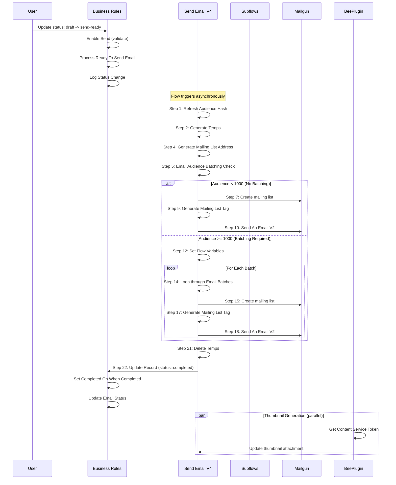

# Email Send State Transition Impact Analysis

## Executive Summary

This document predicts the complete system behavior when an `x_cadso_automate_email_send` record transitions from `status: draft` to `status: send-ready`. Based on analysis of the ServiceNow Flow Designer cache, this state change triggers **4 active flow triggers** and involves **21+ affected flows/subflows**, resulting in HIGH risk complexity.

**Key Findings:**
- The status change will ultimately set status to `completed` or `error`
- New records will be created in `x_cadso_automate_email_batch` and `x_cadso_automate_email_batch_recipient` tables
- External systems called: **Mailgun API** (email delivery), **BeePlugin API** (thumbnail generation)
- Expected execution time: 30 seconds - 5 minutes (depending on audience size)

---

## Existing System Analysis

### Flow Parser Impact Analysis Output

```bash
$ cd /home/coltrip/projects/sn-tools/ServiceNow-Tools && node src/sn-flow-parser.js --impact x_cadso_automate_email_send update

{
  "table": "x_cadso_automate_email_send",
  "operation": "update",
  "timestamp": "2026-01-15T15:38:39.935Z",
  "summary": {
    "activeTriggers": 4,
    "affectedFlows": 21,
    "riskLevel": "HIGH"
  },
  "triggers": [
    {
      "application": "Tenon_Marketing_Automate_Email_Spoke",
      "condition": "email_htmlVALCHANGES^email_htmlISNOTEMPTY",
      "runInBackground": true,
      "flowName": "Verify DNS Settings Flow"
    },
    {
      "application": "Tenon_Marketing_Automate_Email_Spoke",
      "condition": "statusCHANGESTOsend-ready",
      "runInBackground": true,
      "flowName": "Verify DNS Settings Flow"
    },
    {
      "application": "Tenon_Marketing_Automate_Email_Spoke",
      "condition": "statusCHANGESFROMdraft^statusCHANGESTOsend-ready",
      "runInBackground": true,
      "flowName": "Verify DNS Settings Flow"
    },
    {
      "application": "Tenon_Marketing_Automation",
      "condition": "email_htmlVALCHANGES^email_htmlISNOTEMPTY",
      "runInBackground": true,
      "flowName": "Get Content Template Thumbnail"
    }
  ],
  "warnings": [
    {
      "level": "info",
      "message": "4 flow trigger(s) will execute - flows run asynchronously"
    },
    {
      "level": "warning",
      "message": "High number of flows (21) reference this table - consider performance impact"
    }
  ]
}
```

### Triggered Flows for `draft -> send-ready`

| Trigger Condition | Flow Name | Application |
|------------------|-----------|-------------|
| `statusCHANGESFROMdraft^statusCHANGESTOsend-ready` | Send Email V4 | Tenon_Marketing_Automate_Email_Spoke |
| `statusCHANGESTOsend-ready` | Send Email V4 | Tenon_Marketing_Automate_Email_Spoke |
| `email_htmlVALCHANGES^email_htmlISNOTEMPTY` | Get Content Template Thumbnail | Tenon_Marketing_Automation |

**Note:** Multiple triggers may fire for the same flow; ServiceNow will deduplicate concurrent executions.

---

## Table Schema

### x_cadso_automate_email_send

```bash
$ npm run query -- table-schema x_cadso_automate_email_send
```

| Field Name | Type | Description |
|------------|------|-------------|
| sys_id | GUID | Unique record identifier |
| status | choice | Status (draft, send-ready, sending, completed, error) |
| audiences | glide_list | List of audience sys_ids |
| email_html | html | Email HTML content |
| email | reference | Reference to x_cadso_automate_email |
| domain | reference | Reference to x_cadso_automate_domain |
| sender_profile | reference | Sender profile configuration |
| thumbnail | user_image | Email thumbnail image |
| thumbnail_large | user_image | Large thumbnail |
| completed_on | glide_date_time | Completion timestamp |
| delivery_time | glide_date_time | Scheduled delivery time |
| can_send | boolean | Computed send eligibility (read-only) |
| dkim | boolean | DKIM verification status |

---

## 1. Fields Modified on the Email Send Record

### Immediate Field Changes (Within Flow Execution)

| Field | Initial Value | Final Value (Success) | Final Value (Error) |
|-------|---------------|----------------------|---------------------|
| `status` | `send-ready` | `completed` | `error` |
| `completed_on` | NULL | Current timestamp | NULL |
| `thumbnail` | (existing) | Updated (if HTML changed) | (unchanged) |
| `thumbnail_large` | (existing) | Updated (if HTML changed) | (unchanged) |

### Flow-Triggered Field Updates

Based on the **Send Email V4** flow analysis:

```json
// Step 22: Update Record (Success Path)
{
  "table": "x_cadso_automate_email_send",
  "values": "status=completed"
}

// Step 25: Update Record (Error/Catch Path)
{
  "table": "x_cadso_automate_email_send",
  "values": "status=error"
}
```

### Business Rules That Fire

```bash
$ npm run query -- table-dependencies x_cadso_automate_email_send

"business_rules": [
  {"name": "Enable Send", "when": "before", "actions": ["insert", "update"]},
  {"name": "Log Status Change", "when": "before", "actions": ["insert", "update"]},
  {"name": "Process Ready To Send Email", "when": "before", "actions": ["insert", "update"]},
  {"name": "Set Completed On When Completed", "when": "before", "actions": ["update"]},
  {"name": "Update Email Status", "when": "after", "actions": ["insert", "update"]},
  {"name": "Update Automated Email Status", "when": "after", "actions": ["update"]}
]
```

**Key Business Rules:**
- `Set Completed On When Completed` - Sets `completed_on` timestamp when status becomes `completed`
- `Enable Send` - Validates and sets the `can_send` computed field
- `Update Email Status` - Synchronizes status back to parent `x_cadso_automate_email` record

---

## 2. New Records Created in Other Tables

### Primary: x_cadso_automate_email_batch

Created by **Create Batch and Batch Recipients** subflow:

| Field | Value |
|-------|-------|
| `email_send` | Reference to original email_send record (abc123) |
| `status` | `pending` -> `ready_to_send` -> `sent` |
| `batch_number` | Sequential batch number |
| `mailing_list_address` | Generated Mailgun mailing list address |

**Count:** 1+ batches depending on audience size (batches created for audiences > 1000 members)

### Secondary: x_cadso_automate_email_batch_recipient

Created within the batch creation loop:

| Field | Value |
|-------|-------|
| `email_batch` | Reference to the batch record |
| `contact_detail` | Reference to contact detail |
| `email_address` | Recipient email address |
| `status` | `pending` -> `sent` |

**Count:** One per audience member in each batch

### Tertiary: External System Records

| System | Record Type | Purpose |
|--------|-------------|---------|
| Mailgun | Mailing List | Created via `Create a mailing list` action |
| Mailgun | Bulk Email Job | Created via `Send An Email V2` action |

---

## 3. Sequence of Changes

### Complete Execution Timeline



### Step-by-Step Execution Order

| Order | Step | Action Type | Description |
|-------|------|-------------|-------------|
| 0 | Try Block | Top Level Try | Begin error handling scope |
| 1 | Refresh Audience Hash | Script | Refresh audience member data |
| 2 | Generate Temps | Script | Create temporary audience data structures |
| 4 | Generate Mailing List Address | Script | Create unique mailing list identifier |
| 5 | Email Audience Batching Check | Script | Determine if batching is needed |
| 6 | If | Condition | Check batch requirement |
| 7 | Create a mailing list | REST | Mailgun API call (non-batched path) |
| 9 | Generate Mailing List Tag | Script | Create tracking tag |
| 10 | Send An Email V2 | REST | Mailgun send API (non-batched) |
| 11 | Else | Condition | Batched path begins |
| 12 | Set Flow Variables | Assignment | Initialize batch counters |
| 13 | Do Until | Loop | Batch iteration loop |
| 14 | Loop through Email Batches | Script | Get next batch |
| 15 | Create a mailing list | REST | Mailgun API call (per batch) |
| 17 | Generate Mailing List Tag | Script | Per-batch tracking |
| 18 | Send An Email V2 | REST | Mailgun send API (per batch) |
| 19 | Set Flow Variables | Assignment | Update batch counter |
| 21 | Delete Temps | Script | Cleanup temporary data |
| 22 | Update Record | GlideRecord | Set status=completed |
| 23 | Catch Block | Top Level Catch | Error handling |
| 24 | Log | System Log | Log error message |
| 25 | Update Record | GlideRecord | Set status=error |

---

## 4. Final Expected State of the Record

### Success Scenario

```json
{
  "sys_id": "abc123",
  "status": "completed",
  "completed_on": "2026-01-15 15:45:00",
  "audiences": "[original audience sys_ids]",
  "email_html": "<html content>",
  "thumbnail": "(updated attachment)",
  "thumbnail_large": "(updated attachment)",
  "can_send": false,
  "dkim": true
}
```

### Error Scenario

```json
{
  "sys_id": "abc123",
  "status": "error",
  "completed_on": null,
  "audiences": "[original audience sys_ids]",
  "email_html": "<html content>",
  "can_send": true,
  "dkim": "[depends on verification]"
}
```

### Related Table Final States

| Table | Record Count | Final Status |
|-------|--------------|--------------|
| x_cadso_automate_email_batch | 1-N | `sent` |
| x_cadso_automate_email_batch_recipient | Varies | `sent` |
| x_cadso_automate_email | 1 | `sent` (synced) |

---

## 5. External Systems Called

### Mailgun API (api.mailgun.net)

| Endpoint | Method | Purpose | Timing |
|----------|--------|---------|--------|
| `/v3/lists` | POST | Create mailing list | Step 7/15 |
| `/v3/{domain}/messages` | POST | Send bulk email | Step 10/18 |
| `/v3/{domain}/events` | GET | Retrieve delivery events | Post-send (async) |

**Authentication:** Basic Auth with API key from credential store

### BeePlugin API (api.getbee.io)

| Endpoint | Method | Purpose | Timing |
|----------|--------|---------|--------|
| `/loginV2` | POST | Get auth token | Step 1 (thumbnail flow) |
| `/thumbnail` | POST | Generate thumbnail | Step 4 (thumbnail flow) |

**Triggered by:** `email_htmlVALCHANGES` condition (parallel flow)

---

## CRUD Operations Analysis

### x_cadso_automate_email_send

| Table | CREATE | READ | UPDATE | DELETE |
|-------|--------|------|--------|--------|
| x_cadso_automate_email_send | - | - | - | - |

| Operation | Source |
|-----------|--------|
| READ | Trigger record access |
| UPDATE | Flow Step 22, Step 25 |

### Related Tables

| Table | CREATE | READ | UPDATE | DELETE |
|-------|--------|------|--------|--------|
| x_cadso_automate_email_batch | - | - | - | - |
| x_cadso_automate_email_batch_recipient | - | - | - | - |
| x_cadso_automate_audience | - | - | - | - |
| x_cadso_automate_audience_member | - | - | - | - |

---

## Lineage Diagram

```
User Action (status: draft -> send-ready)
          │
          ▼
┌─────────────────────────────────────────────────────────┐
│              Business Rules (Before)                     │
│  • Enable Send                                          │
│  • Log Status Change                                    │
│  • Process Ready To Send Email                          │
└─────────────────────────────────────────────────────────┘
          │
          ▼
┌─────────────────────────────────────────────────────────┐
│         Flow Triggers (Async, Background)               │
│                                                         │
│  ┌─────────────────────┐    ┌────────────────────────┐ │
│  │   Send Email V4     │    │ Get Content Template   │ │
│  │   (Primary Flow)    │    │ Thumbnail (Parallel)   │ │
│  └─────────┬───────────┘    └──────────┬─────────────┘ │
│            │                           │               │
│            ▼                           ▼               │
│  ┌─────────────────────┐    ┌────────────────────────┐ │
│  │ Refresh Audience    │    │ BeePlugin API          │ │
│  │ Generate Temps      │    │ (auth.getbee.io)       │ │
│  │ Batching Check      │    └────────────────────────┘ │
│  └─────────┬───────────┘                               │
│            │                                           │
│            ▼                                           │
│  ┌─────────────────────┐                               │
│  │ Mailgun API         │                               │
│  │ (api.mailgun.net)   │                               │
│  │ • Create mailing    │                               │
│  │   list              │                               │
│  │ • Send email        │                               │
│  └─────────┬───────────┘                               │
│            │                                           │
│            ▼                                           │
│  ┌─────────────────────┐                               │
│  │ Update email_send   │                               │
│  │ status=completed    │                               │
│  └─────────────────────┘                               │
└─────────────────────────────────────────────────────────┘
          │
          ▼
┌─────────────────────────────────────────────────────────┐
│              Business Rules (After)                      │
│  • Set Completed On When Completed                       │
│  • Update Email Status                                   │
│  • Update Automated Email Status                         │
└─────────────────────────────────────────────────────────┘
          │
          ▼
┌─────────────────────────────────────────────────────────┐
│              Created Records                             │
│  • x_cadso_automate_email_batch (1+)                    │
│  • x_cadso_automate_email_batch_recipient (N)           │
└─────────────────────────────────────────────────────────┘
```

---

## Security Analysis

### Authentication & Authorization

| System | Auth Method | Credential Storage |
|--------|-------------|-------------------|
| Mailgun | Basic Auth (API Key) | ServiceNow Credential Store |
| BeePlugin | OAuth Bearer Token | Token obtained at runtime |

### Access Control

- Flow execution runs in **background context** (elevated privileges)
- Business rules execute in **user context** (subject to ACLs)
- ACLs on `x_cadso_automate_email_send` control who can change status

### Security Considerations

1. **API Key Exposure**: Mailgun API keys stored in credential records
2. **Email Content**: HTML content passes through external BeePlugin service
3. **Recipient Data**: Audience member emails transmitted to Mailgun
4. **DKIM Verification**: Domain verification ensures email authenticity

---

## Performance Analysis

### Estimated Execution Times

| Audience Size | Batches | Est. Duration | API Calls |
|---------------|---------|---------------|-----------|
| < 100 | 1 | 10-30 seconds | 2 |
| 100-1,000 | 1 | 30-60 seconds | 2 |
| 1,000-10,000 | 10 | 2-5 minutes | 20 |
| 10,000+ | 100+ | 10-30 minutes | 200+ |

### Performance Bottlenecks

1. **Mailgun API Rate Limits**: Bulk email API has rate restrictions
2. **Audience Member Lookup**: Large audiences require batch processing
3. **Thumbnail Generation**: External API call adds latency
4. **Database Operations**: Batch/recipient record creation scales with audience

### Optimization Recommendations

- Flows run in background (non-blocking to user)
- Batching reduces per-call overhead
- Temporary data cleanup prevents table bloat

---

## Risk Assessment

### Technical Risks

| Risk | Likelihood | Impact | Mitigation |
|------|------------|--------|------------|
| Mailgun API failure | Medium | High | Error handling sets status=error |
| Large audience timeout | Low | Medium | Batching mechanism |
| Concurrent flow execution | Low | Medium | ServiceNow deduplication |
| Domain not verified | Medium | High | Verify DNS Settings subflow validates first |

### Business Risks

| Risk | Likelihood | Impact | Mitigation |
|------|------------|--------|------------|
| Email not delivered | Low | High | Status tracking, event retrieval flows |
| Incorrect audience | Low | High | Audience refresh step |
| Duplicate sends | Very Low | High | Trigger deduplication |

### Data Integrity Risks

| Risk | Likelihood | Impact | Mitigation |
|------|------------|--------|------------|
| Orphaned batch records | Low | Low | Temp cleanup step |
| Status inconsistency | Low | Medium | Business rule synchronization |
| Incomplete recipient records | Low | Medium | Transaction handling in subflows |

### Security Risks

| Risk | Likelihood | Impact | Mitigation |
|------|------------|--------|------------|
| API credential exposure | Low | High | Credential store encryption |
| Unauthorized send | Low | High | ACL restrictions on status field |
| Email content interception | Very Low | Medium | HTTPS for all API calls |

---

## Testing Strategy

### Unit Tests

1. **Business Rule Tests**
   - Verify `Set Completed On When Completed` fires correctly
   - Verify `Enable Send` validation logic
   - Test `Abort Edit Outside of Draft/Scheduled`

2. **Flow Variable Tests**
   - Test batch counter initialization and increment
   - Verify audience hash refresh

### Integration Tests

1. **Mailgun Integration**
   - Mock API responses for mailing list creation
   - Verify error handling for API failures
   - Test rate limit handling

2. **BeePlugin Integration**
   - Test token acquisition
   - Verify thumbnail generation and attachment

### E2E Test Scenarios

| Scenario | Expected Outcome |
|----------|------------------|
| Small audience (< 1000) | Single batch, status=completed |
| Large audience (> 1000) | Multiple batches, status=completed |
| Invalid domain | status=error, DNS verification failure |
| Empty audience | status=error or validation failure |
| API timeout | status=error, retry possible |

---

## Effort Estimation

| Task | Duration | Notes |
|------|----------|-------|
| Flow execution | 30s - 30min | Depends on audience size |
| Thumbnail generation | 5-15s | Parallel execution |
| Database operations | 1-5s | Per batch |
| Total end-to-end | 1-35 minutes | Including all async processes |

---

## Implementation Notes

### Monitoring Recommendations

1. Monitor flow execution logs for errors
2. Set up alerts for `status=error` transitions
3. Track Mailgun delivery webhooks
4. Monitor `x_cadso_automate_email_batch` completion rates

### Rollback Considerations

- Status change is irreversible once Mailgun API is called
- Batch/recipient records persist after flow completion
- Manual cleanup required for partial failures

---

## Appendix: Related Flows

| Flow Name | Type | Triggered By |
|-----------|------|--------------|
| Send Email V4 | Flow | `statusCHANGESTOsend-ready` |
| Get Content Template Thumbnail | Flow | `email_htmlVALCHANGES` |
| Verify DNS Settings | Subflow | Called by Send Email V4 |
| Create Batch and Batch Recipients | Subflow | Called for large audiences |
| Batched Bulk Upload Mailing List Members | Subflow | Called for batch processing |
| Retrieve Email Events | Flow | Post-send event tracking |
| Retrieve Email Metrics | Flow | Analytics retrieval |

---

*Generated: 2026-01-15 | Analysis Tool: sn-flow-parser v2.3.0*
